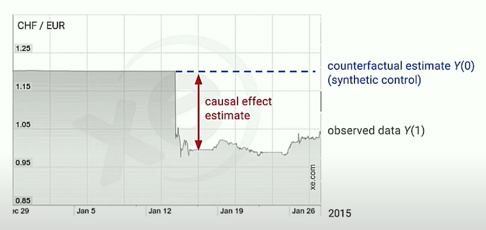
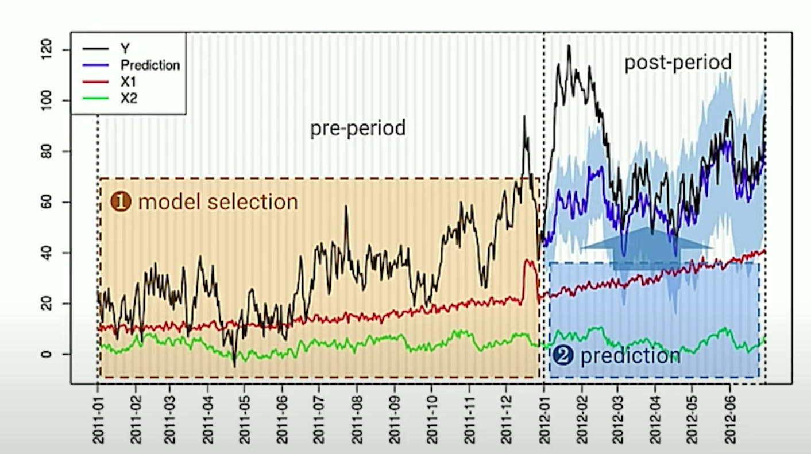
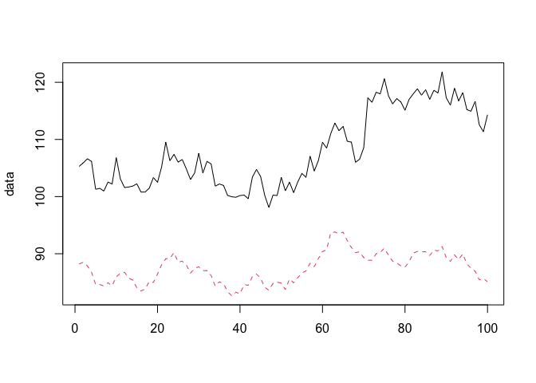
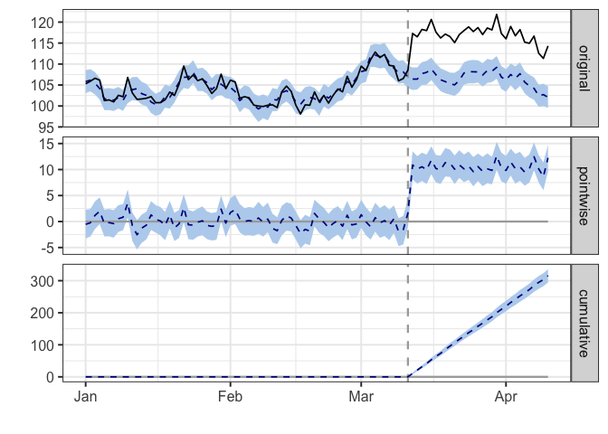

Causal Inference with CausalImpact.
================

Notes related to Causal Inference with
[CausalImpact](https://google.github.io/CausalImpact/CausalImpact.html),
R Package from Google.

## Why Causal Inference?

Let’s say we made changes to a policy, tool, campaign, or process we are
running. We may want to answer the question of what effect did change
`X` have on our service? The gold standard for estimating this effect is
a [randomized control trial](#randomized-control-trial). However, that
might be too difficult, too expensive, unethical, or simply because it
wasn’t done. Causal inference is a technique designed to help estimate
the impact of a change in cases where a randomized experiment is not an
option.

## A simple example

On January 15, 2015, the Swiss National Bank (SNB) [announced it would
no longer hold the Swiss franc at a fixed exchange rate with the
euro](https://www.economist.com/the-economist-explains/2015/01/18/why-the-swiss-unpegged-the-franc).
The image below shows the exchange rate before the announcement, the
observed value after treatment (`Y(1)`) and the expected exchange rate
if no announcement had been made (i.e., the [counterfactual
example](#counterfactual) `Y(0)`).

 [Source:
Youtube - Inferring the effect of an event using CausalImpact by Kay
Brodersen](https://www.youtube.com/watch?v=GTgZfCltMm8)

Key concepts in this image are:

  - `Y(1)` is our observed data, what actually happened after the
    treatment
  - `Y(0)` is our [counterfactual](#counterfactual) estimate, or
    [synthetic control](#synthetic-control), or the expected outcome
    with no treatment
  - `the causal effect estimate` is the difference between the observed
    `Y(1)` and the synthetic control `Y(O)`, or the difference between
    the two outcomes.

## The problem of causal inference

We cannot observe the potential outcomes with and without the treatment
at the same time. For instance, we cannot see a single patient’s outcome
if we administered and did not administer a drug at the same time. The
outcomes are mutually exclusive; to address this, our options are.

1.  Run a controlled experiment, where we see some of the potential
    outcomes with and without treatment.
2.  Use observational methods, to try to estimate the effect in the
    absence of a controlled experiment.
3.  Master time travel.

## CausalImpact

What is the `CausalImpact` approach to this problem?

### Building A Model

In order to use the `CausalImpact` package, we need a few things.

1.  Treatment at the time (t)
2.  A time series of our target observation (`Y`)
      - This time series must be broken up into a `pre-period` and a
        `post-period` groups.
3.  One more co-variate, “predictor” time-series sets (`X1`, and `X2`),
    that they themselves are not impacted by the treatment at the time
    (t).

We leverage these co-variate sets to estimate the synthetic-control,
which we use to estimate our causal effect in the `post-period`.


[Source: Youtube - Inferring the effect of an event using CausalImpact
by Kay Brodersen](https://www.youtube.com/watch?v=GTgZfCltMm8)

## Assumptions

It is assumed we have:

1.  One or more control (`predictor`) time series that they themselves
    are not affected by the intervention
2.  The relationship between the covariates and the treated time series
    are established during the pre-period, and remain stable in the post
    period.

## A Code

``` r
suppressMessages(library(zoo))
suppressMessages(library(CausalImpact))

# <https://google.github.io/CausalImpact/CausalImpact.html>
set.seed(1)
x1 <- 100 + arima.sim(model = list(ar = 0.999), n = 100) # generate covariate series
y  <- 1.2 * (x1) + rnorm(100)     
y[71:100] <- y[71:100] + 10
time.points <- seq.Date(as.Date("2014-01-01"), by = 1, length.out = 100)
data <- zoo(cbind(y, x1), time.points)
head(data)
```

    ##                   y       x1
    ## 2014-01-01 105.2950 88.21513
    ## 2014-01-02 105.8943 88.48415
    ## 2014-01-03 106.6209 87.87684
    ## 2014-01-04 106.1572 86.77954
    ## 2014-01-05 101.2812 84.62243
    ## 2014-01-06 101.4484 84.60650

``` r
matplot(data, type = "l")
```

<!-- -->

``` r
pre.period <- as.Date(c("2014-01-01", "2014-03-11"))   # We need to tell the model what observations occurred prior to treatment
post.period <- as.Date(c("2014-03-12", "2014-04-10"))  # We also need to identify the post-treatment period

impact <- CausalImpact(data, pre.period, post.period)
plot(impact)
```

<!-- -->

``` r
summary(impact)
```

    ## Posterior inference {CausalImpact}
    ## 
    ##                          Average        Cumulative  
    ## Actual                   117            3511        
    ## Prediction (s.d.)        107 (0.35)     3196 (10.38)
    ## 95% CI                   [106, 107]     [3176, 3217]
    ##                                                     
    ## Absolute effect (s.d.)   11 (0.35)      316 (10.38) 
    ## 95% CI                   [9.8, 11]      [294.4, 336]
    ##                                                     
    ## Relative effect (s.d.)   9.9% (0.32%)   9.9% (0.32%)
    ## 95% CI                   [9.2%, 11%]    [9.2%, 11%] 
    ## 
    ## Posterior tail-area probability p:   0.00101
    ## Posterior prob. of a causal effect:  99.8994%
    ## 
    ## For more details, type: summary(impact, "report")

## Key Questions

#### Question: How many co-variate (predictor) time series do you need to successfully to this analysis?

Relying on a single co-variate time series runs the risk of reacting
quickly to the specifics of the co-variate series. Instead, it is
recommended that a handful or a few dozen co-variate time series be
used. Enough to guard against spurious correlations, but few that you
can understand and explain what each of these time series means.

[Source: Youtube - Inferring the effect of an event using CausalImpact
by Kay Brodersen @ 26:41](https://youtu.be/GTgZfCltMm8?t=1601)

#### Question: Can you use this method to calculate the impact of multiple events if they overlap in time?

As of 2016, this was an open research question. Need to do additional
research to determine if this is still true.

[Source: Youtube - Inferring the effect of an event using CausalImpact
by Kay Brodersen @ 28:21](https://youtu.be/GTgZfCltMm8?t=1701)

#### Question: The causal impact estimate seems to be at the mercy of the credible intervals. Are tools to analyze and potentially reduce the confidence interval in that post-treatment period?

The confidence interval reflects the uncertainty in our prediction. As
you get further out into the future, you are less certain of the output
and expect that confidence interval to expand. The better your predictor
series are explaining the target, the tighter your confidence intervals
are likely to be. The inverse of that, if you don’t have any good
predictor time series, then your confidence interval will be wide and
reflect that uncertainty.

[Source: Youtube - Inferring the effect of an event using CausalImpact
by Kay Brodersen @ 28:42](https://youtu.be/GTgZfCltMm8?t=1732)

#### Question: How do we identify ‘good’, covariate predictor time-series?

We want to find time series that are related to our outcome variable, to
our original time series, but are not affected by out treatment.
Consider a scenario when we launch an advertising campaign for a
product. Co-variate time series for this analysis might include queries
for the competitor brand, Google Trends data, order volumes for some of
your other products, or other time series data that is available during
the same period.

[Source: Youtube - Inferring the effect of an event using CausalImpact
@ 14:02](https://youtu.be/y3hLJnB6O7c?t=783)

## Key Term(s)

### Bayesian Structural Time Series

> Statistical technique used for feature selection, time series
> forecasting, nowcasting, inferring causal impact, and other
> applications. The model is designed to work with time-series data.
> 
> <https://en.wikipedia.org/wiki/Bayesian_structural_time_series>

Consists of three primary components

1.  Kalman filter
2.  Spike-and-Slab
3.  Bayesian Model Averaging

This is the technique leveraged under-the-hood of
[CausalImpact](https://google.github.io/CausalImpact/) package, and
available in the
[bsts](https://cran.r-project.org/web/packages/bsts/bsts.pdf) R package
on CRAN.

### Kalman filter

> The Kalman filter is an iterative, mathematical process that uses a
> set of equations and consecutive data inputs to quickly estimate the
> true value, position, velocity, of the object being measured, when the
> measured values contain unpredicted or random error, uncertainty or
> variation.
> 
> <https://www.youtube.com/watch?v=CaCcOwJPytQ&list=PLX2gX-ftPVXU3oUFNATxGXY90AULiqnWT>

More specifically, we can describe the relationship between an
observation at the current time-step `x_current` as a function of the
previous time step `x_previous`, some constant `a`, the current
observation in our system `z_current`, and a noise measurement at the
current time step `v_current`.

`x_current` = `a` \* `x_previous` `z_current` = `x_current` +
`v_current`

More generally, this translates into

`x_current` = `a` \* `x_previous` + `v_current`

<https://simondlevy.academic.wlu.edu/kalman-tutorial/the-extended-kalman-filter-an-interactive-tutorial-for-non-experts-part-3/>

Further research required…

### spike-and-slab

Bayesian variable selection technique. Particularly useful when the
number of possible predictors is large compared to the number of
observations.

<https://en.wikipedia.org/wiki/Spike-and-slab_regression>

Further research required…

### Bayesian model averaging

Ensembling technique for combining Bayesian models.

<https://en.wikipedia.org/wiki/Ensemble_learning#Bayesian_model_averaging>

Further research required…

### counterfactual

> Counterfactual conditionals (also subjunctive or X-marked) are
> conditionals which discuss what would have been true under different
> circumstances, e.g., “If it was raining right now, then Sally would be
> inside.” Counterfactuals are characterized grammatically by their use
> of fake past tense marking, which some languages use in combination
> with other kinds of morphology, including aspect and mood.
> 
> <https://en.wikipedia.org/wiki/Counterfactual_conditional>

Consider the extension to marketing if we launch an ad campaign and
observe the outcome. The counterfactual would be the outcome if we did
not launch the campaign.

### causal inference

> The process of concluding a causal connection based on the conditions
> of the occurrence of an effect. The main difference between causal
> inference and inference of association is that the former analyzes the
> response of the effect variable when the cause is changed.
> 
> <https://en.wikipedia.org/wiki/Causal_inference>

In this context, it could be thought of as the branch of statistics
focused on effects, or the consequences of our actions.

### causality

> Influence by which one event, process, or state (a cause) contributes
> to the production of another event, process, or state (an effect)
> where the cause is partly responsible for the effect, and the effect
> is partly dependent on the cause.
> 
> <https://en.wikipedia.org/wiki/Causality>

*In simpler terms, `B` happened because of `A`.*

### randomized control trial

> A randomized controlled trial (or randomized control trial RCT) is a
> type of scientific (often medical) experiment that aims to reduce
> certain sources of bias when testing the effectiveness of new
> treatments; this is accomplished by randomly allocating subjects to
> two or more groups, treating them differently, and then comparing them
> with respect to a measured response
> 
> <https://en.wikipedia.org/wiki/Randomized_controlled_trial>

In this example, each group would receive a distinct `treatment`.

### synthetic control

> The synthetic control method is a statistical method used to evaluate
> the effect of an intervention in comparative case studies. It involves
> the construction of a weighted combination of groups used as controls,
> to which the treatment group is compared. This comparison is used to
> estimate what would have happened to the treatment group if it had not
> received the treatment.
> 
> <https://en.wikipedia.org/wiki/Synthetic_control_method>

In other words, it is a technique where we generate a control group from
existing data points.

## Additional Resources:

  - [Google Blog: CausalImpact: A new open-source package for estimating
    causal effects in time
    series](https://opensource.googleblog.com/2014/09/causalimpact-new-open-source-package.html)
  - [Google Research: Inferring causal impact using Bayesian structural
    time-series models](https://research.google/pubs/pub41854/)
  - [google/CausalImpact](http://google.github.io/CausalImpact/)
  - [YouTube: Inferring the effect of an event using CausalImpact by Kay
    Brodersen](https://www.youtube.com/watch?v=GTgZfCltMm8)
  - [Fitting Bayesian structural time series with the bsts R
    package](http://www.unofficialgoogledatascience.com/2017/07/fitting-bayesian-structural-time-series.html)
