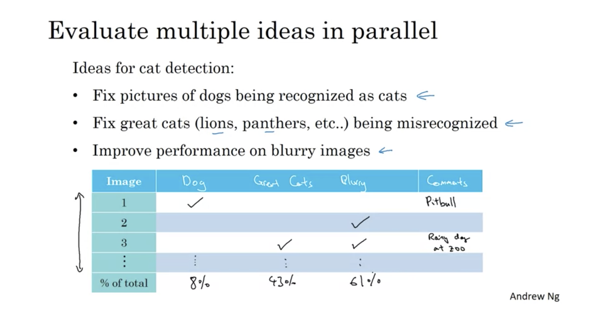
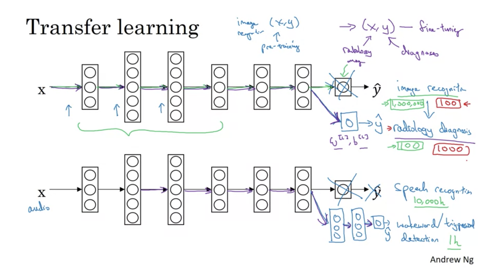
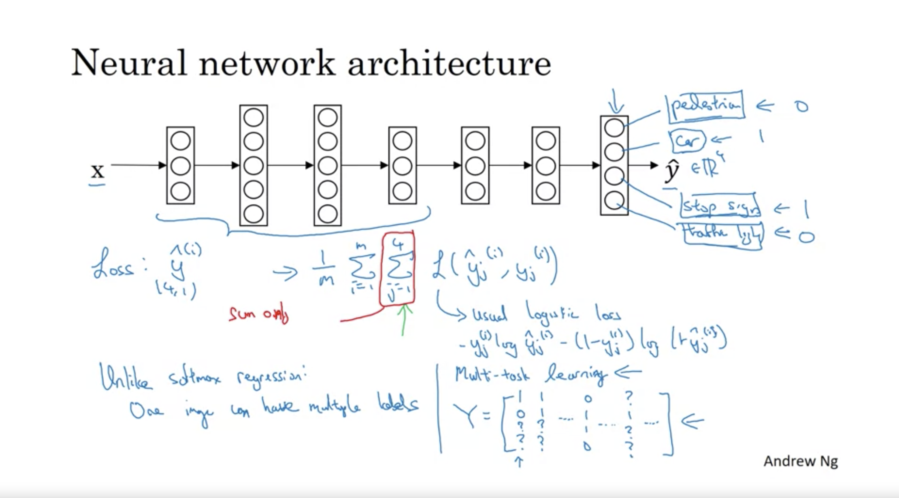

```{r setup, include=FALSE}
library(dplyr)
library(ggplot2)
library(knitr)
knitr::opts_chunk$set(echo = TRUE)
```

class: inverse

## Week 1: [ML Strategy](https://www.coursera.org/learn/machine-learning-projects/home/week/1)

## Key Concepts

- Understand why Machine Learning strategy is important
- Apply satisficing and optimizing metrics to set up your goal for ML projects
- Choose a correct train/dev/test split of your dataset
- Understand how to define human-level performance
- Use human-level perform to define your key priorities in ML projects
- Take the correct ML Strategic decision based on observations of performances and dataset

---

## Orthogonalization: Tuning In Machine Learning

Consider the act of driving a car. In a vehicle, each of the controls, including the steering wheel, brakes, gear selector, and gas pedal, all impact the vehicle independently of one another.  These controls are considered orthogonal of one another. This makes tuning the car more straightforward than if multiple 'knobs' controlled a single output (i.e., if speed were a determined by 0.9 * steering angle + 0.5)

The instructor extends this to tuning an ML model, with a chain of assumptions for building a model:

1. Fit a training set well on a cost function
  - To Fix: Bigger Network; Adam
2. Fit a dev set well on a cost function
  - To Fix: Regularization; Larger Development Set
3. Fit a test set well on a cost function
  - To Fix: Bigger Dev Set; Ensure correct distribution
4. Performs well in the real world
 - To Fix: Change Dev Set; Change Cost function

???

In another framing, this is a separation of concerns concerning inputs.  Each 'knob' represents the tuning of an element that does not impact the others. In the geometric sense, these could be considered knobs that make changes along unit vectors perpendicular to one another.

---

## Choosing A Model: Satisficing and Optimizaing Metrics

Consider the scenario where you care about model accuracy and have a speed and size requirement at score time (faster than 100ms) and size (smaller than 10mb in memory). By choosing an optimizing metric (a cost-sensitive error metric), you would select the model that provides the best score for the optimizing, as long as it satisfies the (i.e., meets or exceeds the satisficing metrics.


| classifier | accuracy | size (Mb) | score time (ms) |
|------------|----------|-----------|-----------------|
| A          | 90%      | 8 Mb      | 80 ms           |
| B          | 92%      | 9 Mb      | 90 ms           |
| C          | 95%      | 20 Mb     | 50 ms           |
| D          | 98%      | 6 Mb      | 2000 ms         |

We would choose `B`.  It provides the best score for the optimizing metric (accuracy) while meeting the minimum requirements for all of the satisficing metrics (fast enough and small enough).

---

## Bayes Error; Avoidable Bias; and Human performance

Improving a model is a cost-optimization problem. Deciding where to apply effort should reflect where there is the most opportunity.

| Type        | Error  | Notes     |
|-------------|--------|--------------------------------------------------------------------|
| Bayes Error | 3%     | The lowest we can ever achieve (potentially un-knowable).          | 
| Human Error | 5%     | What can a human achieve? It can serve as a proxy for Bayes error. |
| Train Error | 10%    | How did we perform on the training set?                            |
| Dev Error   | 12%    | How did we perform on the development set?                         |

Based on the scenario above, we can look to improve our model by reducing 5% of avoidable bias. (10% Train - 5% Human error, i.e., the proxy for Bayes error). Compare this to 2% of our variance problem. We should focus on the bias error first.

???

Eventually, models may surpass human performance, leaving us without a proxy for Bayes error. This tends to occur with structural data, not based on human perception, where there is a lot of data. (i.e. online marketing, product recommendation, logistics, loan approvals)Improving a model is a cost-optimization problem. Deciding where to apply effort for the greatest benefit requires a few additional concepts.

---

class: inverse

## Week 2: [ML Strategy](https://www.coursera.org/learn/machine-learning-projects/home/week/2)

## Key Concepts

- Understand what multi-task learning and transfer learning are
- Recognize bias, variance and data-mismatch by looking at the performances of your algorithm on train/dev/test sets

---

## Error Analysis

Reviewing a random selection of errors in the dev or test set can help identify sub-sets of data to focus on. Again, this should be a cost-sensitive prioritization. It can help evaluate multiple ideas in parallel.



---

## Transfer Learning

Transfer learning (TL) is a research problem in machine learning (ML) that focuses on storing knowledge gained while solving one problem and applying it to a different but related problem. For example, the knowledge gained while learning to recognize cars could apply when trying to recognize trucks.



---

## Multi-Task Learning

Multi-task learning (MTL) is a subfield of machine learning in which multiple learning tasks are solved at the same time while exploiting commonalities and differences across tasks. This can result in improved learning efficiency and prediction accuracy for the task-specific models when compared to training the models separately.


