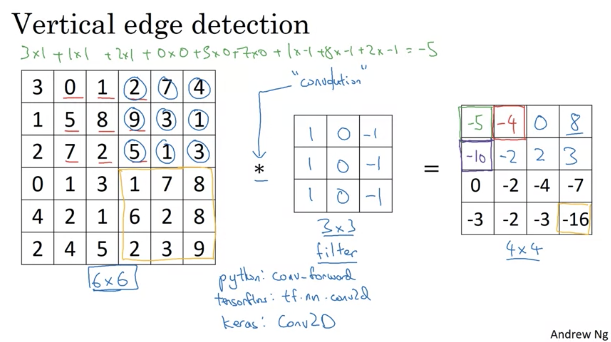
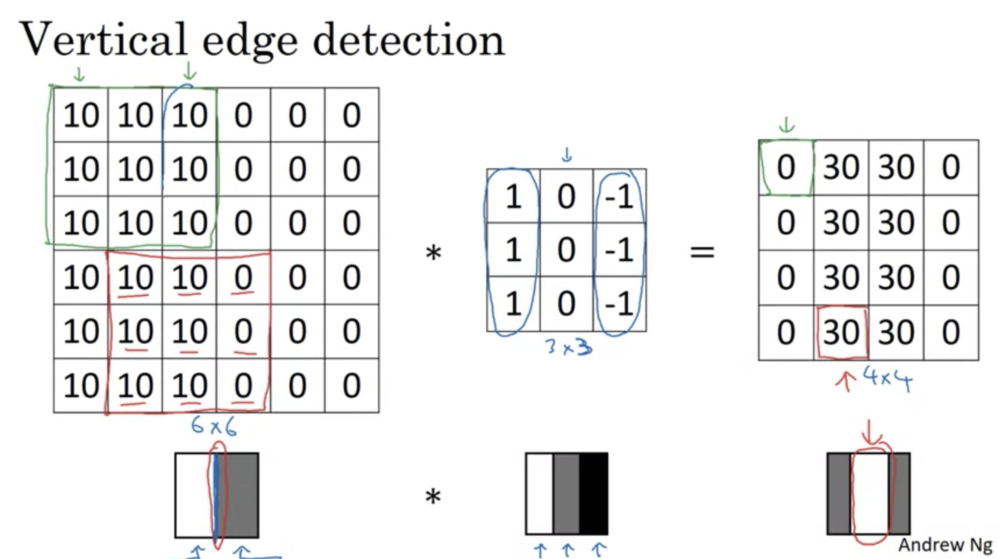
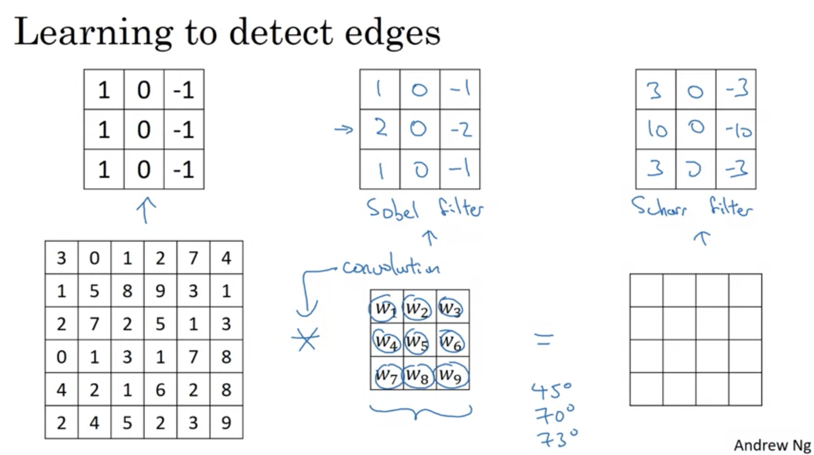
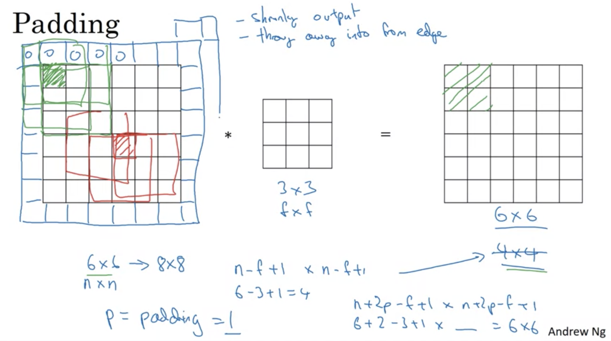
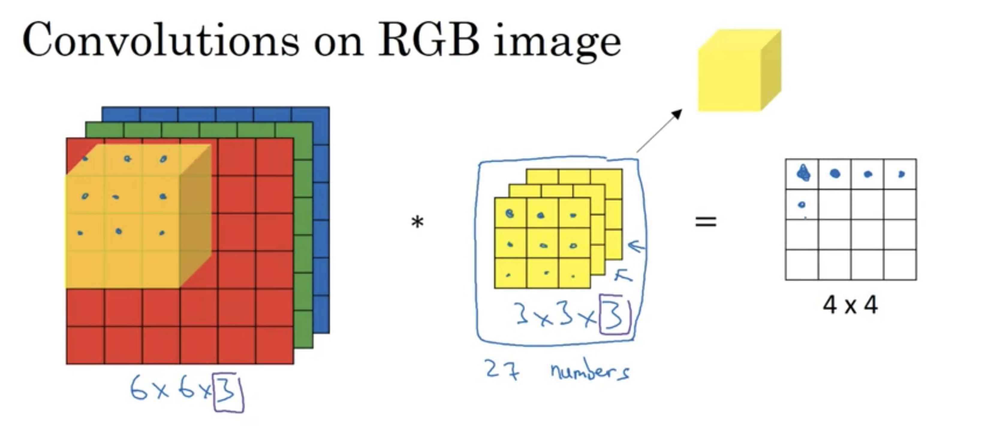
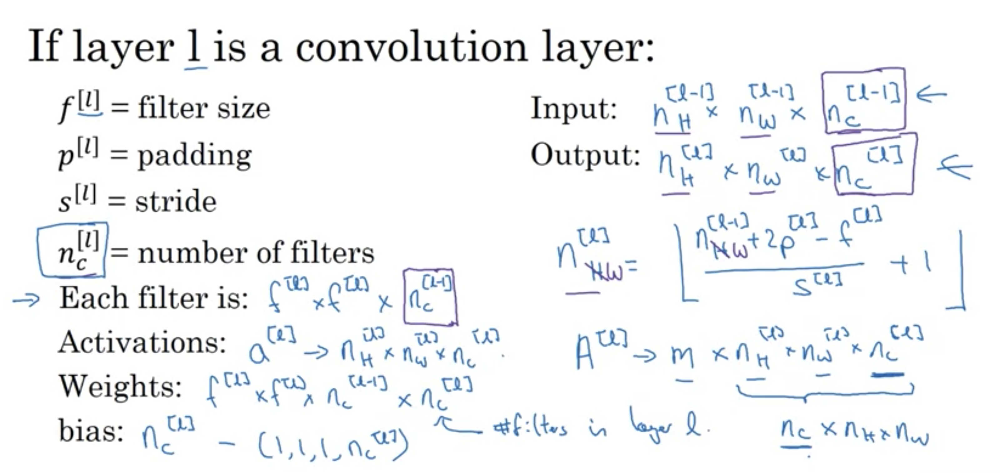
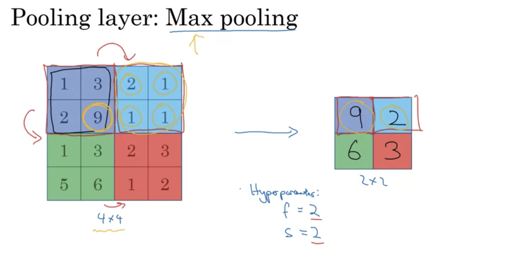
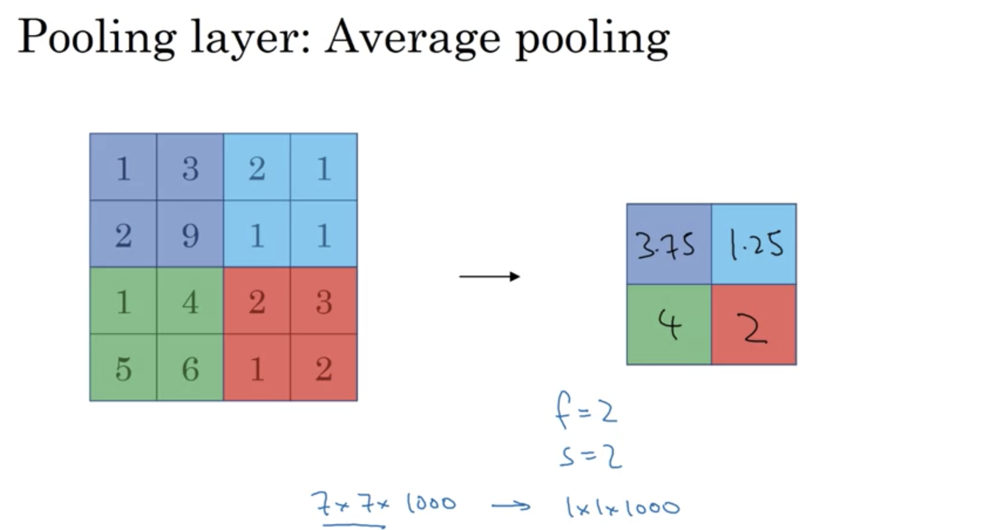
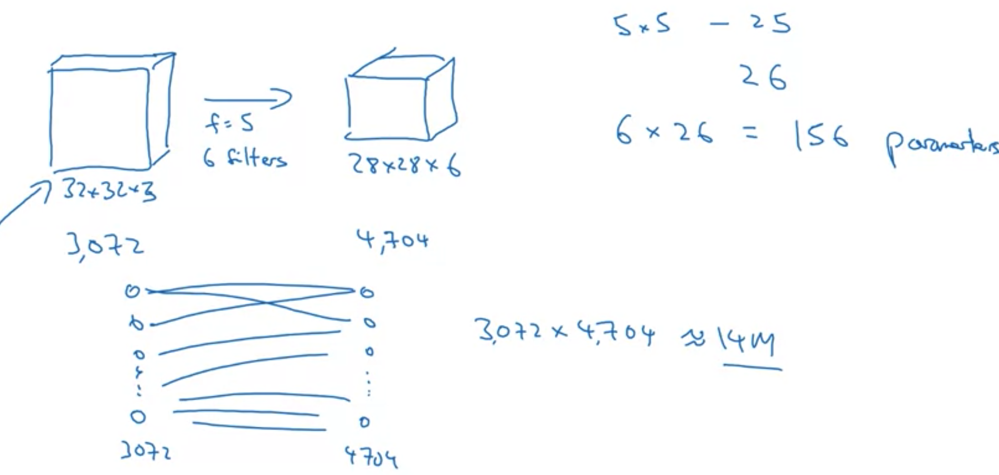
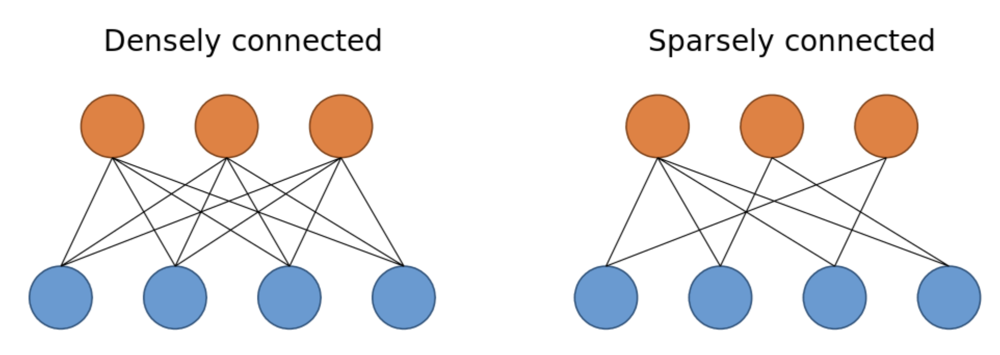

```{r setup, include=FALSE}
library(dplyr)
library(ggplot2)
library(knitr)
knitr::opts_chunk$set(echo = TRUE)
```

class: inverse

## Week 1: [Foundations of Convolutional Neural Networks](https://www.coursera.org/learn/convolutional-neural-networks/home/week/1)

Learn to implement the foundational layers of CNNs (pooling, convolutions) and to stack them properly in a deep network to solve multi-class image classification problems.

## Key Concepts

- Understand the convolution operation
- Understand the pooling operation
- Remember the vocabulary used in convolutional neural network (padding, stride, filter, etc.)
- Build a convolutional neural network for image multi-class classification

---

## Computer Vision Problems

Example Image Problems

- Image Classification
- Object Detection
- Image Segmentation
- Neural Style Transfer

Training on large images on traditional feed-forward NN requires a large number of parameters to train, and therefore a significant volume of data to avoid overfitting.  The convolution operation helps to remedy that problem for images.

---

## Understanding Convolution

In the convolution process, a 'kernel filter' is applied in a windowed fashion to an upstream matrix. The operation is the sum of the element-wise products of the window.



---

## Convolution: Edge Detection

Vertical edge detection is an application of the convolution operation. The adequately configured kernel can identify vertical edges by applying the by moving around in a windowed process.  



---

## Convolution: Learning Kernel Filters

Many options exist for kernel filters; however, kernel parameters can be learned rather than hardcoded.  Kernels need not be limited to horizontal or vertical; instead, the NN can learn the 'best' kernel through the forward and back-propagation processes.



---

## Convolution: Padding

When applying a convolution to an image, without padding, the size of the downstream matrix is reduced in dimensions. Adding a layer of pixels around the outside allows the edge pixels to provide more information to the next layer. It prevents the shrinking of images in networks with many convolutional layers.



---

## Convolutions: Paddings - Valid and Same 

- **valid:** add no padding; 
  - final output layer dimensions $n - f + 1$ by $n - f + 1$

- **same:** provide padding such that the output size is the same of the output size.
  - final output dimensions: $n + 2p - f  + 1$ by $n + 2p - f  + 1$
  - To ensure input $n = n + 2p - f  + 1$
  - $p = \frac{f - 1}{2}$


---

## Strided and Padded Convolutions

When applyting the windowed function, you can 'skip' over windows with different units of 'stride'.  The base implementation is a stride of 1, hitting every possible combination.  With padding $p$, stride $s$, filter size $f$, and beginning matrix size $n$, the final layer's dimensions can be described with the following dimensions:

$\frac{n + 2p - f}{s} + 1$ by $\frac{n + 2p - f}{s} + 1$

---

## Convolutions on Volumes

Consider the 'stack' of an image for each channel (i.e., color). We can apply a filter with the same number of channels in a similar convolutional pattern as a "moving cube" for convolution.  This operation can compress multiple channels into a single channel.



These filter outputs can be stacked, creating layers with additional channels at lower levels.

---

## Convolutional Notation



---

## Pooling Layers: Max Pooling

Max pooling is another application of a windowed operation; however, instead of taking the sum of the element-wise products, we instead take the maximum value of the window.  The stride and filter concepts still apply to determine how the window moves around the original matrix (or volume).  Each `channel` has the pooling layer used independently of one another: no parameters to learn, just a fixed function.



---

## Pooling Layers: Average Pooling

Unlike taking the max value, average pooling takes the average: no parameters to learn, just a fixed function.



---

## Why Convolutions? Parameter Sharing

The use of convolutions helps to reduce the total number of parameters.  This is due in-part to *Parameter Sharing*, or a feature detector (such as a vertical edge detector) that is useful in multiple parts of the image.  Each filter can be a mechanism for such a feature detector.

Consider the example below, to go from a 32x32x3 (3072 unit) volume to a 28x28x6 (4074 unit) volume; it would require more than 12.5 million parameters.  With convolution, we can achieve the same transformation with six filters, of size 5, with only 156 parameters.



---

## Why Convolutions? Sparsity of Connections

The *sparsity of connections*, (i.e., a given output unit is dependent on only a small number of input units), is useful to reduce the computational cost of training neural networks. The sparsity of connections inhibits overfitting during network training and keeps the size of the neural network significantly small at the same time, not affecting baseline accuracy. 



---

class: inverse

## Week 2: [Deep convolutional models: case studies](https://www.coursera.org/learn/convolutional-neural-networks/home/week/2)

Learn about the practical tricks and methods used in deep CNNs straight from the research papers.

## Key Concepts

- Understand multiple foundational papers of convolutional neural networks
- Analyze the dimensionality reduction of a volume in a very deep network
- Understand and Implement a Residual network
- Build a deep neural network using Keras
- Implement a skip-connection in your network
- Clone a repository from GitHub and use transfer learning

---

class: inverse

## Week 3: [Object detection](https://www.coursera.org/learn/convolutional-neural-networks/home/week/3)

Learn how to apply your knowledge of CNNs to one of the tightest but hottest fields of computer vision: Object detection.

## Key Concepts

- Understand the challenges of Object Localization, Object Detection and Landmark Finding
- Understand and implement non-max suppression
- Understand and implement intersection over union
- Understand how we label a dataset for an object detection application
- Remember the vocabulary of object detection (landmark, anchor, bounding box, grid, ...)

---

class: inverse

## Week 4: [Special applications: Face recognition & Neural style transfer](https://www.coursera.org/learn/convolutional-neural-networks/home/week/4)

Discover how CNNs can be applied to multiple fields, including art generation and face recognition. Implement your algorithm to generate art and recognize faces!

---

