Convolutional Neural Networks
================
Brandon Beidel
2020/06/01

## Week 1: [Foundations of Convolutional Neural Networks](https://www.coursera.org/learn/convolutional-neural-networks/home/week/1)

Learn to implement the foundational layers of CNNs (pooling,
convolutions) and to stack them properly in a deep network to solve
multi-class image classification problems.

## Key Concepts

  - Understand the convolution operation
  - Understand the pooling operation
  - Remember the vocabulary used in convolutional neural network
    (padding, stride, filter, etc.)
  - Build a convolutional neural network for image multi-class
    classification

-----

## Computer Vision Problems

Example Image Problems

  - Image Classification
  - Object Detection
  - Image Segmentation
  - Neural Style Transfer

Training on large images on traditional feed-forward NN requires a large
number of parameters to train, and therefore a significant volume of
data to avoid overfitting. The convolution operation helps to remedy
that problem for images.

-----

## Understanding Convolution

In the convolution process, a ‘kernel filter’ is applied in a windowed
fashion to an upstream matrix. The operation is the sum of the
element-wise products of the window.

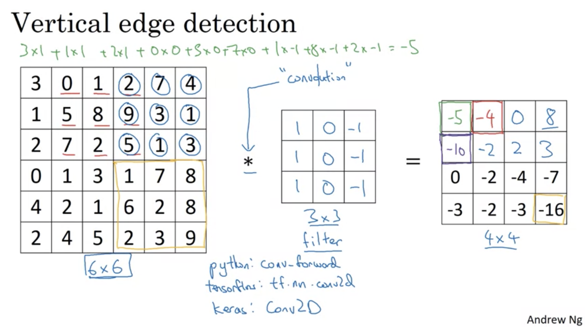

-----

## Convolution: Edge Detection

Vertical edge detection is an application of the convolution operation.
The adequately configured kernel can identify vertical edges by applying
the by moving around in a windowed process.

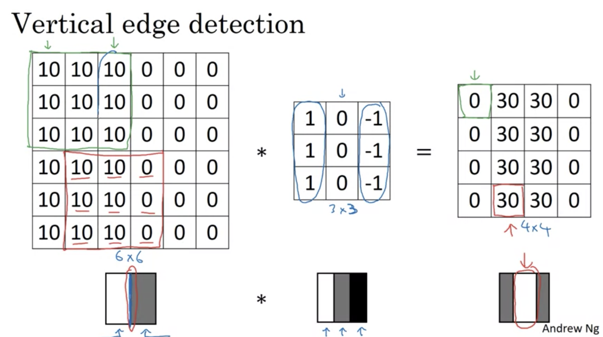

-----

## Convolution: Learning Kernel Filters

Many options exist for kernel filters; however, kernel parameters can be
learned rather than hardcoded. Kernels need not be limited to horizontal
or vertical; instead, the NN can learn the ‘best’ kernel through the
forward and back-propagation processes.

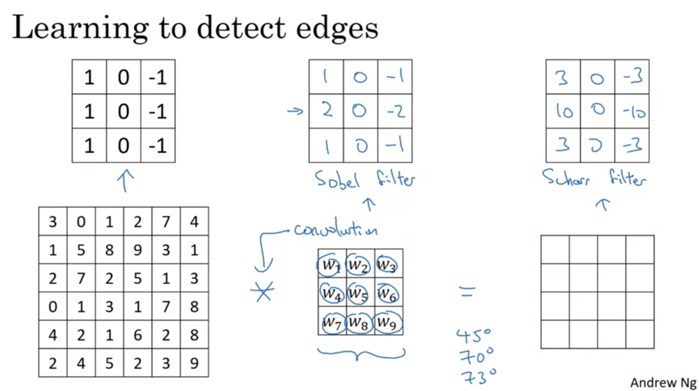

-----

## Convolution: Padding

When applying a convolution to an image, without padding, the size of
the downstream matrix is reduced in dimensions. Adding a layer of pixels
around the outside allows the edge pixels to provide more information to
the next layer. It prevents the shrinking of images in networks with
many convolutional layers.

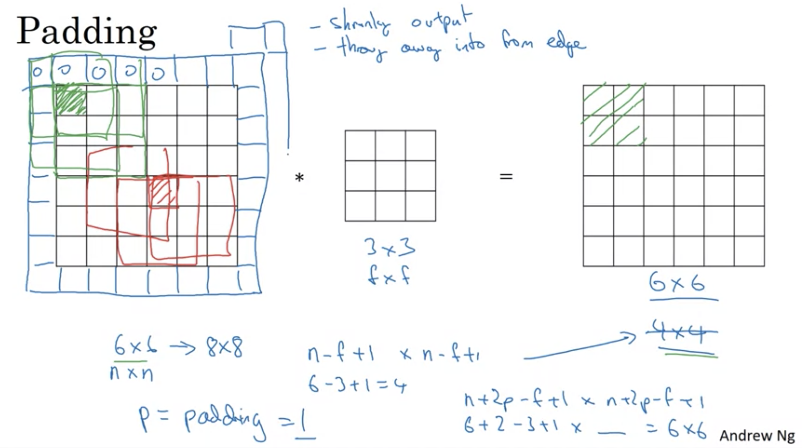

-----

## Convolutions: Paddings - Valid and Same

  - **valid:** add no padding;
      - final output layer dimensions \(n - f + 1\) by \(n - f + 1\)
  - **same:** provide padding such that the output size is the same of
    the output size.
      - final output dimensions: \(n + 2p - f + 1\) by
        \(n + 2p - f + 1\)
      - To ensure input \(n = n + 2p - f + 1\)
      - \(p = \frac{f - 1}{2}\)

-----

## Strided and Padded Convolutions

When applyting the windowed function, you can ‘skip’ over windows with
different units of ‘stride’. The base implementation is a stride of 1,
hitting every possible combination. With padding \(p\), stride \(s\),
filter size \(f\), and beginning matrix size \(n\), the final layer’s
dimensions can be described with the following dimensions:

\(\frac{n + 2p - f}{s} + 1\) by \(\frac{n + 2p - f}{s} + 1\)

-----

## Convolutions on Volumes

Consider the ‘stack’ of an image for each channel (i.e., color). We can
apply a filter with the same number of channels in a similar
convolutional pattern as a “moving cube” for convolution. This operation
can compress multiple channels into a single channel.

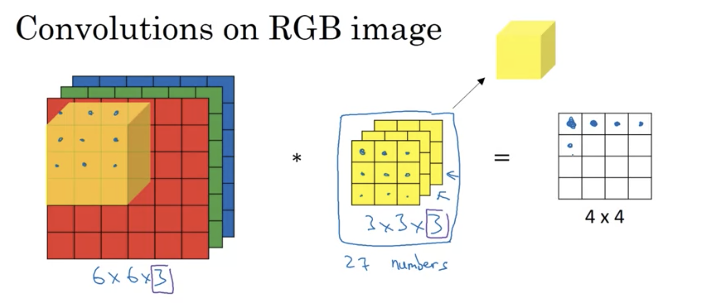

These filter outputs can be stacked, creating layers with additional
channels at lower levels.

-----

## Convolutional Notation

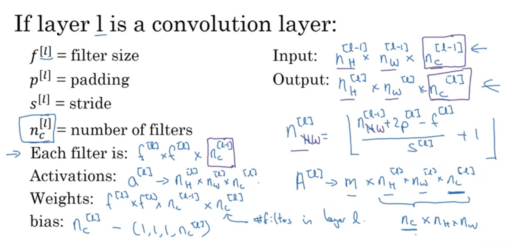

-----

## Pooling Layers: Max Pooling

Max pooling is another application of a windowed operation; however,
instead of taking the sum of the element-wise products, we instead take
the maximum value of the window. The stride and filter concepts still
apply to determine how the window moves around the original matrix (or
volume). Each `channel` has the pooling layer used independently of one
another: no parameters to learn, just a fixed function.

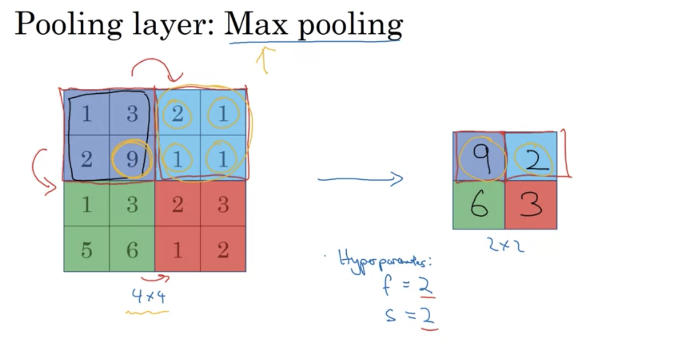

-----

## Pooling Layers: Average Pooling

Unlike taking the max value, average pooling takes the average: no
parameters to learn, just a fixed function.

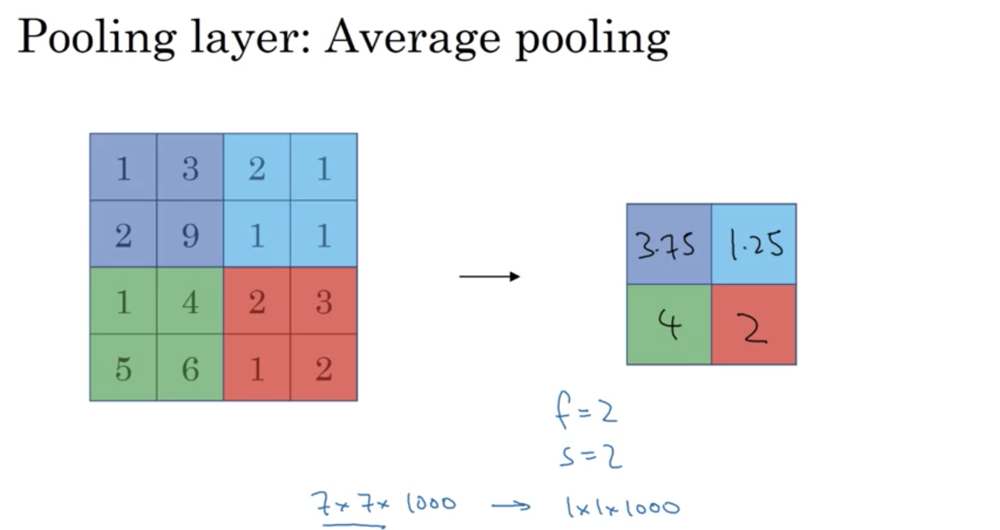

-----

## Why Convolutions? Parameter Sharing

The use of convolutions helps to reduce the total number of parameters.
This is due in-part to *Parameter Sharing*, or a feature detector (such
as a vertical edge detector) that is useful in multiple parts of the
image. Each filter can be a mechanism for such a feature detector.

Consider the example below, to go from a 32x32x3 (3072 unit) volume to a
28x28x6 (4074 unit) volume; it would require more than 12.5 million
parameters. With convolution, we can achieve the same transformation
with six filters, of size 5, with only 156 parameters.

-----

## Why Convolutions? Sparsity of Connections

The *sparsity of connections*, (i.e., a given output unit is dependent
on only a small number of input units), is useful to reduce the
computational cost of training neural networks. The sparsity of
connections inhibits overfitting during network training and keeps the
size of the neural network significantly small at the same time, not
affecting baseline accuracy.

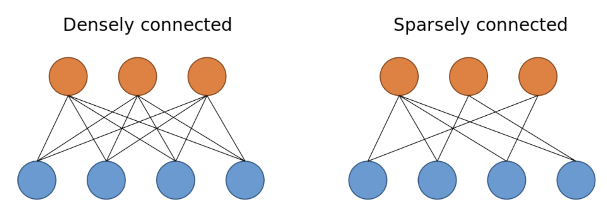

-----

## Week 2: [Deep convolutional models: case studies](https://www.coursera.org/learn/convolutional-neural-networks/home/week/2)

Learn about the practical tricks and methods used in deep CNNs straight
from the research papers.

## Key Concepts

  - Understand multiple foundational papers of convolutional neural
    networks
  - Analyze the dimensionality reduction of a volume in a very deep
    network
  - Understand and Implement a Residual network
  - Build a deep neural network using Keras
  - Implement a skip-connection in your network
  - Clone a repository from GitHub and use transfer learning

-----

## Week 3: [Object detection](https://www.coursera.org/learn/convolutional-neural-networks/home/week/3)

Learn how to apply your knowledge of CNNs to one of the tightest but
hottest fields of computer vision: Object detection.

## Key Concepts

  - Understand the challenges of Object Localization, Object Detection,
    and Landmark Finding
  - Understand and implement non-max suppression
  - Understand and implement intersection over union
  - Understand how we label a dataset for an object detection
    application
  - Remember the vocabulary of object detection (landmark, anchor,
    bounding box, grid, …)

-----

## Object Localization

As an output, provide a class label and the attributes of a bounding
box, \(( p_{c}, b_{x}, b_{y}, b_{h}, b_{w} )\).

For the cost functions, only consider the class label,
\(\mathcal{L}(\hat{y}, y)\), not the bounding boxes.

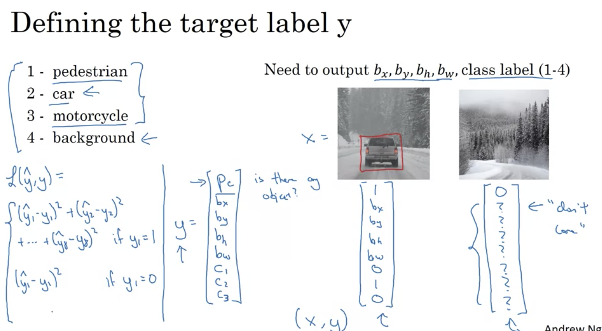

-----

## Landmark Detection

Rather than outputting a bounding box, we can instead output the
coordinates of essential points. i.e., provide a string of points
outlining the points on a face.

Example use-cases include points of faces, postures, outlines of
objects.

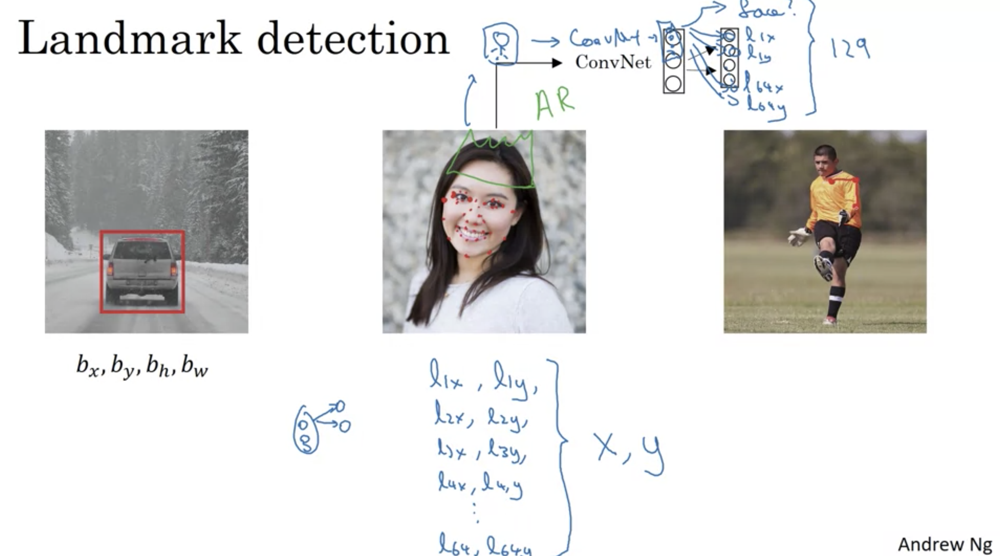

-----

## Object Detection: Sliding Window Algorithm

  - Given a classifier, trained on close-cropped images
  - move around an image, checking specific windows
  - start with a small region, increase small size region and increase
    size w/ iteration

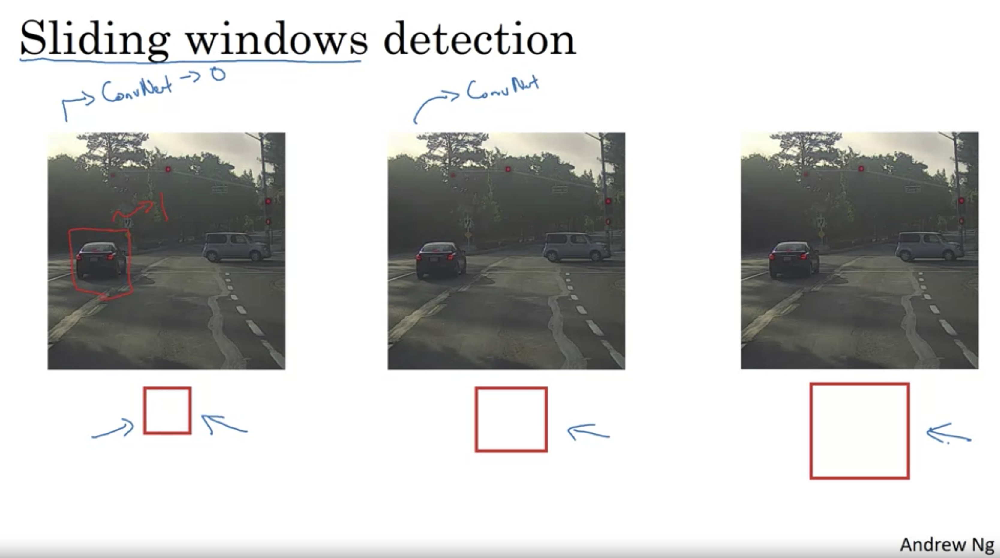

This is computationally intensive. However, it can be implemented with
convolutions, adding complexity, but leveraging the shared computations.

 

-----

## Bounding Boxes Predictions: Intersection Over Union

Intersection over union is an evaluation metric used to measure the
accuracy of a predictor on a particular dataset. It considers the number
of pixels that overlap between the two bounding boxes (intersection) as
it relates to the size of the union set of both boxes.

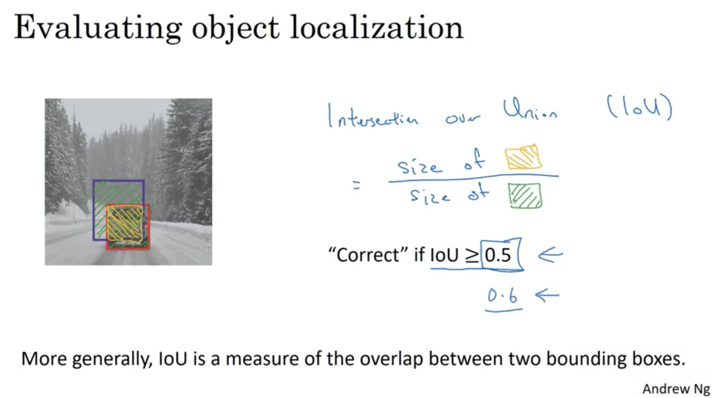

-----

## Non-Max Suppression

In cases where many grid-cells think they have the midpoint of an
object, this algorithm is used to suppress non-maximal values.

1.  Identify a grid where `p` is high.
2.  Eliminate and other predicted objects where `IoU` is above a given
    threshold

The thresholds are configurable parameters…

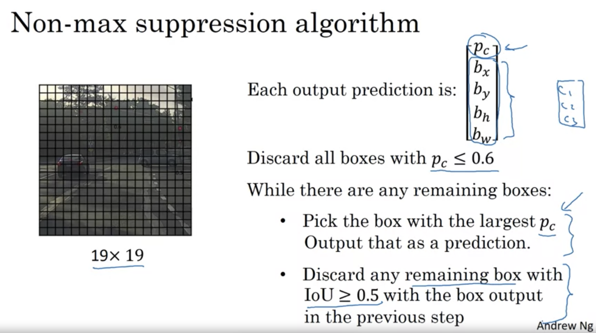

-----

## Anchor Boxes

For each grid-cell, multiple boxes can be filled. At prediction time,
each grid cell will get a prediction for each bounding box.

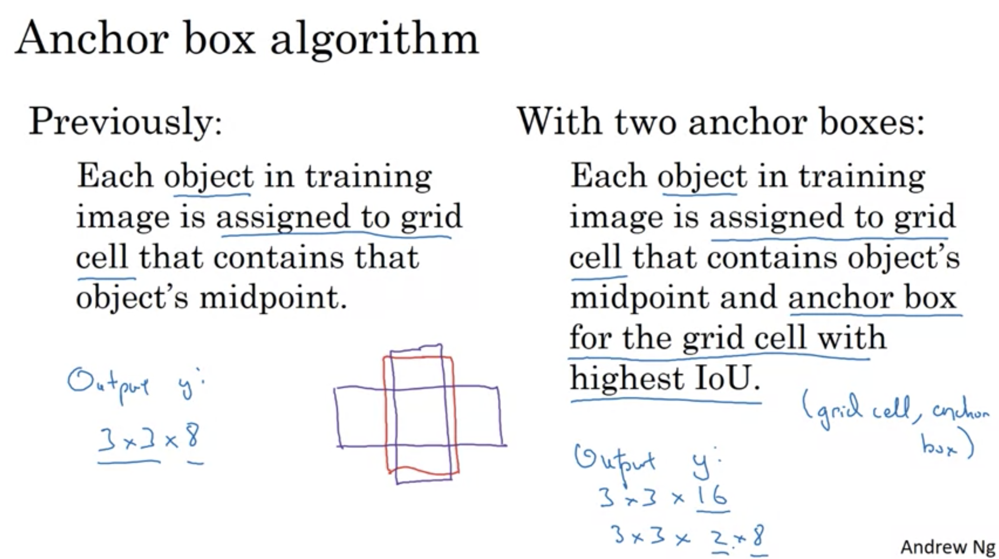

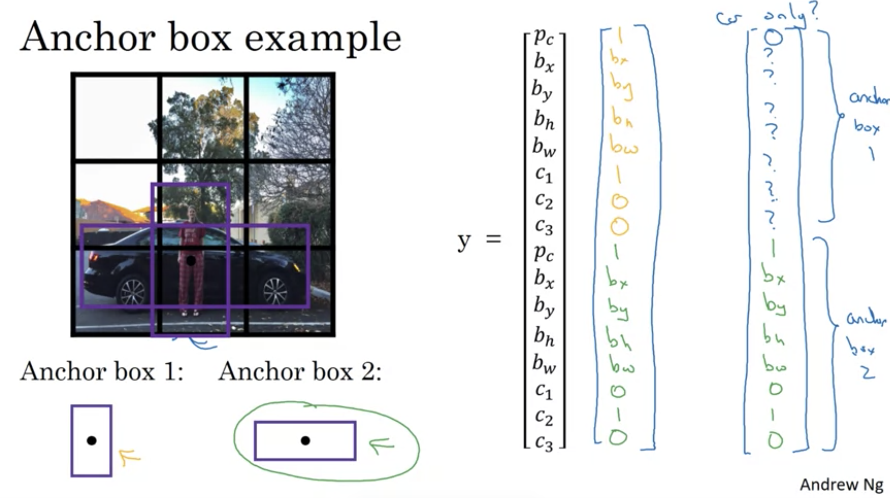

-----

## YOLO

YOLO combines these concepts into a consolidated algorithm

  - Images are broken down into grid cells
  - Multiple anchor boxes permitted per cell
  - Non-max suppression algorithm applied to final output

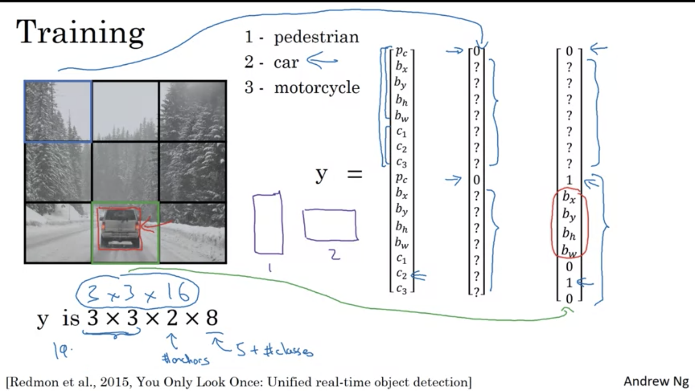   —

## Week 4: [Special applications: Face recognition & Neural style transfer](https://www.coursera.org/learn/convolutional-neural-networks/home/week/4)

Discover how CNNs can be applied to multiple fields, including art
generation and face recognition. Implement your algorithm to generate
art and recognize faces\!

-----

## Facial Verification

  - Input is an image; a name, and an id
  - Output answer the question: Is this an image of the claimed person?

## Facial Recognition

  - Have a list of `K` persons
  - Input an image
  - Output: id of a person, if there is a match

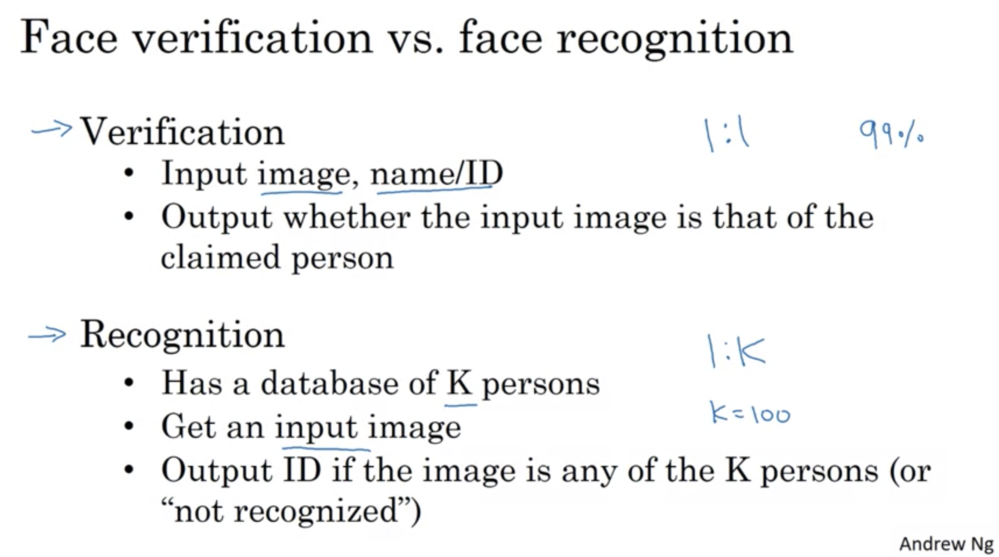

## One-Shot Learning

For many facial recognition tasks, you need to recognize a person given
just a single example. Instead of training these conv-nets
traditionally, there is a desire to learn a similarity function and
determine the degree of difference between the two images.

If the images are close together (i.e., very similar), then they are the
same, else they are different.

## Siamese Networks

1.  Take two images
2.  Generate encodings based on the trained model
3.  Determine the distance between two images, as the norm of the
    difference between two vectors

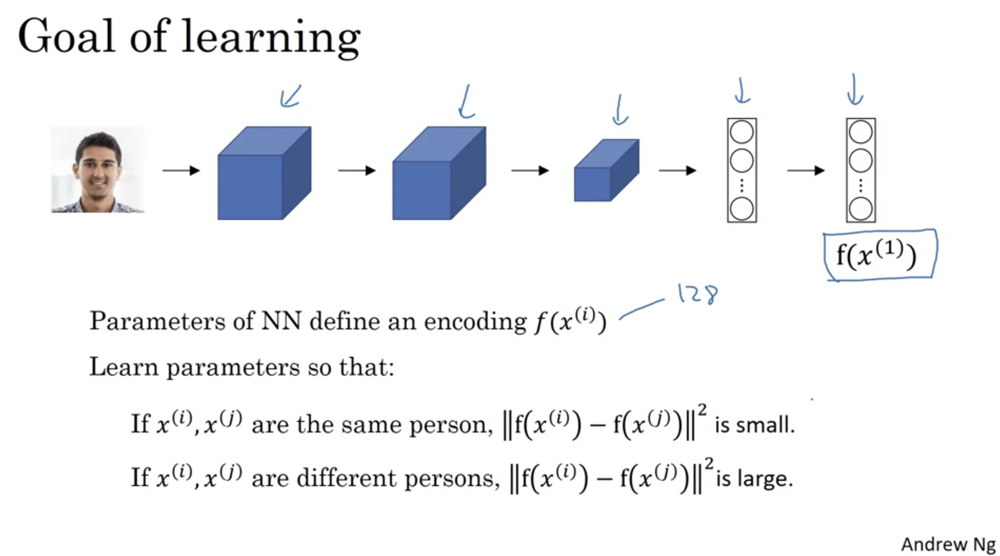

## Triplet Loss Function

We want to define a loss function in terms of three inputs, an Anchor
Image (A), a positive Image (P) (i.e., same class), and a negative image
(N) (i.e., not the same category). We want A & P to be close together,
and A & N to be far apart. When we talk about distance, we are referring
to the norm of the difference. A margin term is added to the triplet
loss, alpha.

## Triplet Loss: Learning Objective

## Triplet Loss: Definition

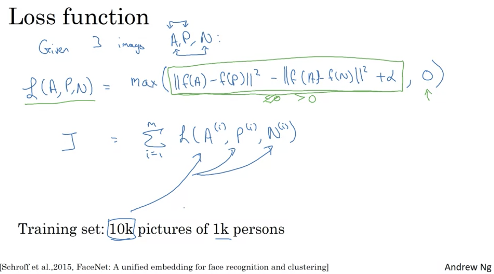

## Triplet Loss: Picking Triplets

During training, if A, P, N are chosen randomly, then `d(A, P) + alpha <
d(A, N)` is easily satisfied. Instead, by selecting triplets that are
hard to train on the rate of learning can increase.

## Triplet Loss as Binary Classification

Rather than solely relying on the Triplet loss, we can use a binary
output that combines with our similarity function to determine if the
outputs are the same.

## Neural Style Transfer

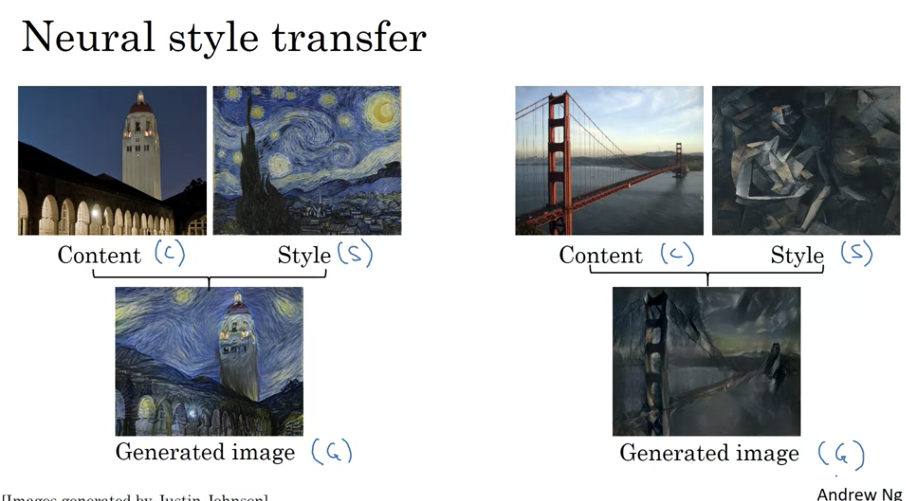

## Neural Style Transfer: Cost Function

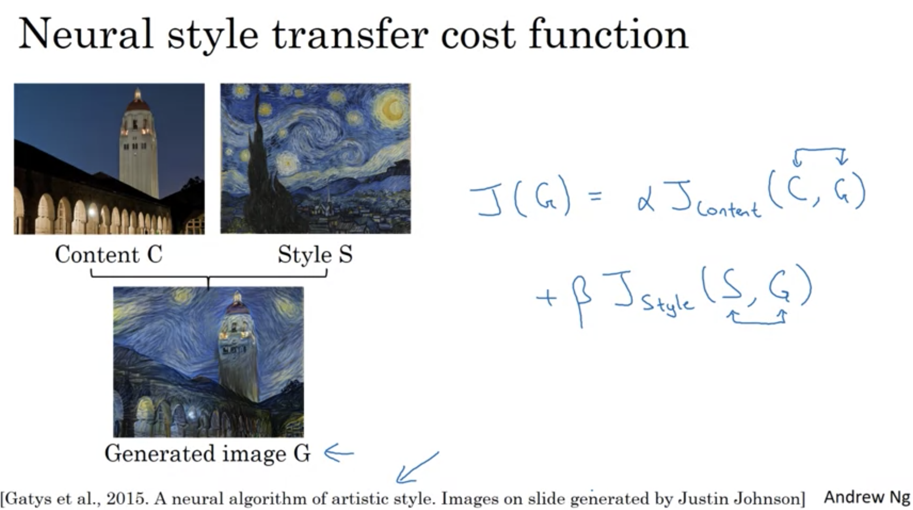

## Neural Style Transfer: Content Cost Function

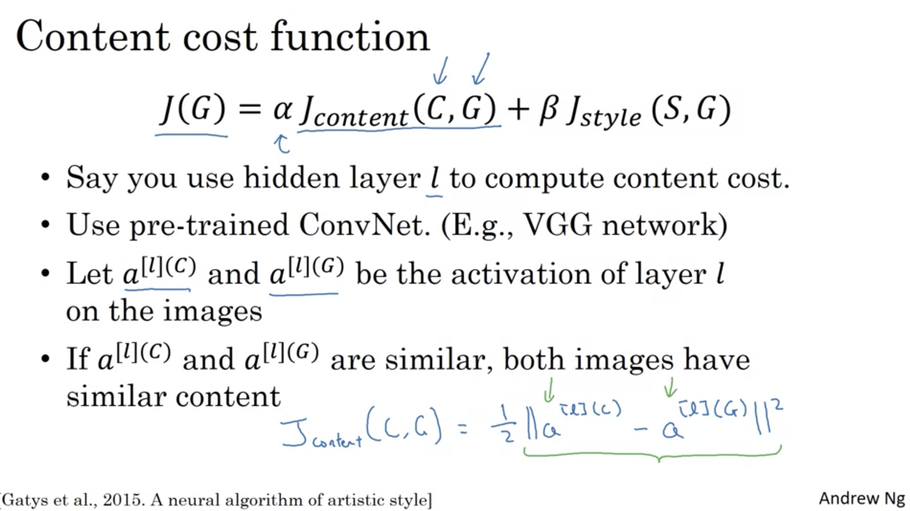

## Neural Style Transfer: Style Cost Function

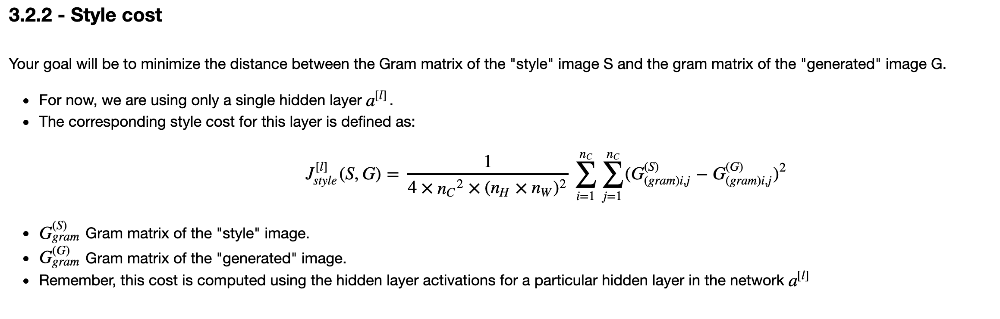 
