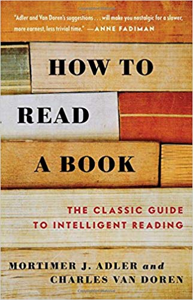
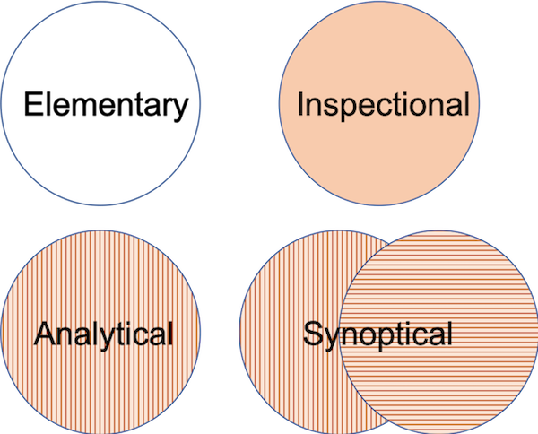
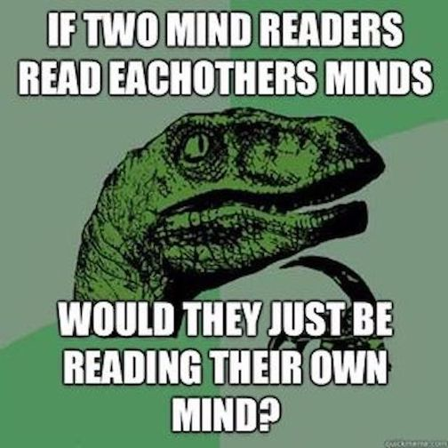

```{r setup, include=FALSE, echo=FALSE}
knitr::opts_chunk$set(echo = FALSE)
# install.packages('VennDiagram')
library(VennDiagram)
```

## Probably not the right mindset...

> "I took a speed reading course and read 'War and Peace' in twenty minutes. It involves Russia."
>
> `r tufte::quote_footer('--- Woody Allen')`

<div class="notes">
- This tongue-in-cheek, likely (misattributed) joke strikes at a key concept in reading. 
- We do not read everything for the same purpose, so our strategies should not always be the same.
- Different jobs, a different tool.

Objectives: 
- introduce you to 'How to Read a Book.'
- identify different levels and approaches to reading
- learn some tools and techniques for your application
</div>

--- 

<div class="centered">
  
<div>

<div class="notes">
- Mortimer Adler & Charles Van Doren, 1940s
- Concern: Rise of radio and television taking away the attention (and intellect) of America
- Goal: 
  - To reintroduce key reading techniques 
  - Encourage the engagement of 'The Great Conversation.' 
    - (i.e., Western Literature Homer to the near-present)
    - Exchange of ideas, philosophies, arguments happening over centuries
</div>

---

<div class="centered">
  
</div>

<div class="notes">
- Four Levels of Reading: 
  - Elementary Reading:
    - Vocabulary
    - Context Clues
    - Understanding Sentences in Isolation
  - Inspectional Reading
    - Focus on Time
    - Skimming Indexes, Reading Titles, Inspecting Structure
    - Building a roadmap in your mind
  - Analytic Reading
    - As the reader, can I understand what the full text is trying to convey?
    - i.e., What is the author's message, context, and history?
  - Syntopical Reading
    - What does this text say concerning all other texts on the topic?
    - How does it relate to texts that came before? Does it respond directly, borrow or steal?
</div>

## Tool: Asking The Right Questions {.centered}



<div class="notes">
  1. What is the book about as a whole?
    - Elemenatary, Inspectional
  2. What is being said in detail, and how?
    - Elementary, Inspectional
  3. Is the book true in whole or in part?
    - Analytical
  4. What about it?
    - Analytical, Syntoptical
</div>

## Tools: Agreeing Or Disagreeing

'Valid' Arguments for disagreeing with the author

1. "You are uninformed" 
2. "You are misinformed"
3. "You are illogical -- your reasoning is not cogent"
4. "Your analysis is incomplete"
