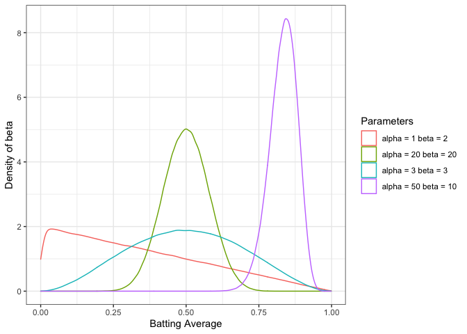
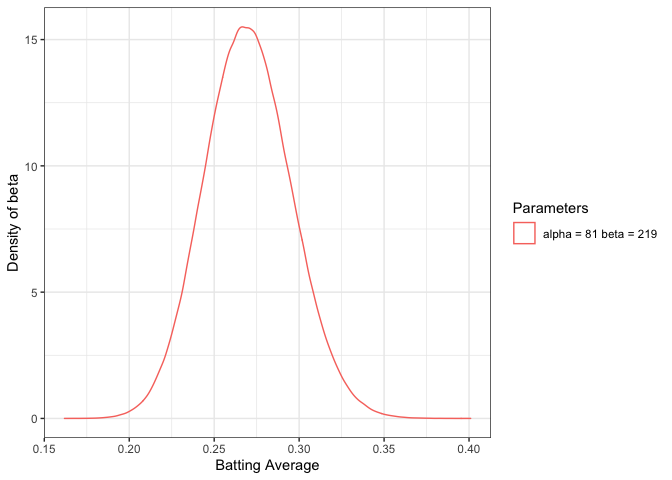
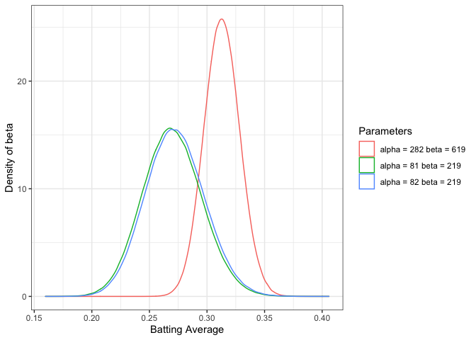
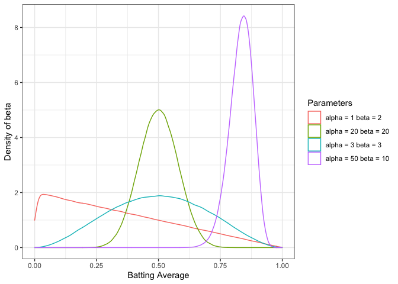

Introduction To Empirical Bayes Notes
================

Notes from [Introduction to Empirical Bayes: Examples from Baseball
Statistics](http://varianceexplained.org/r/empirical-bayes-book/) by
David Robinson

## Why Empirical Bayes?

Empirical Bayesian methods are an approximation to more exact methods,
but come with some controversy. However, EB methods are well suited for
Data Science because

  - Though EB is Inacurate with few observations, with large datasets
    performance can be comperable to traditional Baysiean methods
  - EB provides shortcuts that allow easy computation at scale;
    Approximate in a fraction of the time of full Baysien Methos

We can use EB as a fast approximation technique, when we have many
observations.

## 2 The beta distribution

The *beta distribtion* is a probability distribution with two Parameters
\(\alpha\) (alpha) and \(\beta\) (beta). The distribution is constrained
between 0 an 1. In practice, it is good at representing a probabilty
distribution of probabilities.

<!-- -->

### 2.1 The Binomial Distribution

The *binomial distribution* models a count of successes out of the
total. To follow the baseball analogy, for 100 at-bats we would say the
number of hits a player will get is distribted according to
`Binomial(100, p)` where `p` is the probability that at-bat `AB` will be
a hit `H`. In the baseball case, the `p` the thing we want estimate is a
batting average.

> Batting Average = Hits / At Bats

### 2.2 Updating The Beta Distribution

We can build an existing belief (prior) regarding what a reasonable
batting average should be. The text suggests that belief is 0.27, with
an alpha = 81, and beta of 219. However, a batting average could
reasonably range from 0.21 to 0.35 (see plot below). So if we start with
this existing belief of where any players true batting average *could
be*, how do we update our prior beliefs based on new information as the
player gets at-bats in.

<!-- -->

This idea, `prior expectations + new information = new expectation` is a
simplificiation of the Bayesian Philosopy. In the case of updating our
beta distribution, the update rule is very simple.

> Beta(alpha0 + hits, beta0 + misses)

So, if a player were to have a hit on their first at-bat, the new beta
would be be Beta(82, 219). When we plot both distributions we can see
that the posterior distribution shifts slightly to the right. The
movement is very small, however, if we were to consider a batter who has
hit 200 out of 600 at bats, the new posterier would be be Beta(282,
619), a much bigger shift, since we have collected more evidence for the
update rule.

<!-- -->

### 2.2.1 Calculating The Posterier Mean

The expected mean of the Beta distribution can be described as:

> alpha / (alpha + beta)

## 2.3 Conjugate Prior

Why is the update so easy? It is becuase the beta distribution is the
[conjugate prior](https://en.wikipedia.org/wiki/Conjugate_prior#Example)
of the Binomial distribution. Which means there are clear cut rules on
how to update the prior to get to the posterier distribution. [Wikipedia
has a
list](https://en.wikipedia.org/wiki/Conjugate_prior#Table_of_conjugate_distributions).
If a prior is not a conjugate pior, then the update can get messy.

Consider a player who got exactly 100 hits in the first 300 at bats. So,
let’s simulate some batting statistics for the first 300 at bats.
Starting with our prior belief regarding the distribution of batting
averages we start with Beta(81, 219)

    ## Warning: Ignoring unknown aesthetics: line

    ## `stat_bin()` using `bins = 30`. Pick better value with `binwidth`.

<!-- -->
