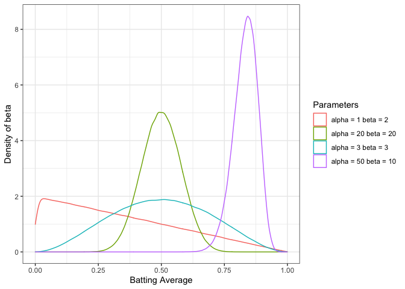
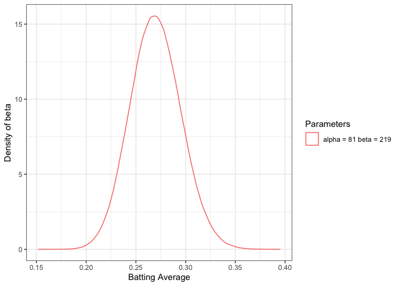
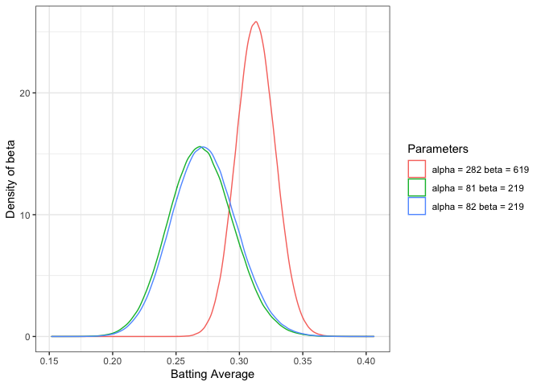
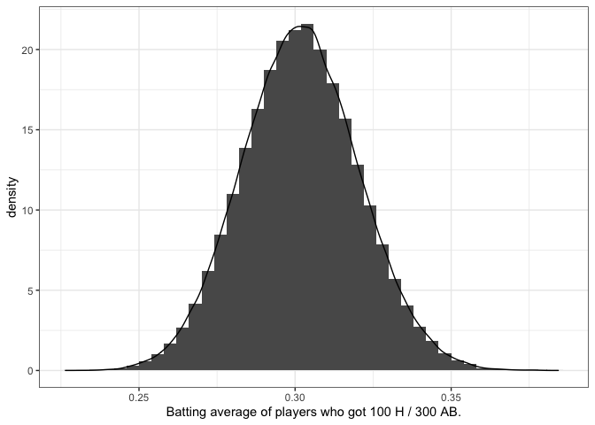

Introduction To Empirical Bayes Notes.
================

Notes from [Introduction to Empirical Bayes: Examples from Baseball
Statistics](http://varianceexplained.org/r/empirical-bayes-book/) by
David Robinson

## Why Empirical Bayes?

Empirical Bayesian methods are an approximation to more exact methods
but come with some controversy. However, EB methods are well suited for
Data Science because

  - Though EB is Inaccurate with few observations, with large datasets
    performance can be comparable to traditional Bayesian methods
  - EB provides shortcuts that allow easy computation at scale;
    Approximate in a fraction of full Bayesian Methods time.

We can use EB as a fast approximation technique when we have many
observations.

## 2 The beta distribution

The *beta distribtion* is a probability distribution with two Parameters
\(\alpha\) (alpha) and \(\beta\) (Beta). The distribution is constrained
between 0 and 1. In practice, it is good at representing a probability
distribution of probabilities.

<!-- -->

### 2.1 The Binomial Distribution

The *binomial distribution* models a count of successes out of the
total. To follow the baseball analogy, for 100 at-bats, we would say the
number of hits a player will get is distributed according to
`Binomial(100, p)` where `p` is the probability that at-bat `AB` will be
a hit `H.` In the baseball case, the `p` the thing we want estimate is a
batting average.

> Batting Average = Hits / At Bats

### 2.2 Updating The Beta Distribution

We can build an existing belief (prior) regarding what a reasonable
batting average should be. The text suggests that belief is 0.27, with
an alpha = 81, and Beta of 219. However, a batting average could
reasonably range from 0.21 to 0.35 (see plot below). So if we start with
this existing belief of where any players true batting average *could
be*, how do we update our prior beliefs based on new information as the
player gets at-bats in.

<!-- -->

This idea, `prior expectations + new information = new expectation`, is
a simplification of the Bayesian Philosophy. In the case of updating our
beta distribution, the update rule is straightforward.

> Beta(alpha<sub>0</sub> + hits, beta<sub>0</sub> + misses)

So, if a player were to have a hit on their first at-bat, the new Beta
would be Beta (82, 219). When we plot both distributions, we can see
that the posterior distribution shifts slightly to the right. However,
the movement is minimal if we were to consider a batter who has hit 200
out of 600 at-bats. The new posterior would be Beta (282, 619), a much
more significant shift, since we have collected more evidence for the
update rule.

``` r
size = 1e6
tibble::tibble(
  alpha = c(81, 82, 282),
  beta  = c(219, 219, 619),
) %>% dplyr::mutate(
  batting_average  = purrr::map2(alpha, beta, ~ rbeta(size, .x, .y)),
  Parameters = paste0("alpha = ", alpha, " beta = ", beta)
) %>% 
  tidyr::unnest(batting_average) %>%
  ggplot2::ggplot(ggplot2::aes(x = batting_average, color = Parameters)) + 
  ggplot2::geom_density() + 
  ggplot2::xlab("Batting Average") +
  ggplot2::ylab("Density of beta") + 
  theme_bw()
```

<!-- -->

#### 2.2.1 Calculating The Posterier Mean

The expected mean of the Beta distribution can be described as:

> alpha / (alpha + beta)

### 2.3 Conjugate Prior

Why is the update so easy? It is because the beta distribution is the
[conjugate prior](https://en.wikipedia.org/wiki/Conjugate_prior#Example)
of the Binomial distribution. This means there are clear cut rules on
updating the prior to get to the posterior distribution. [Wikipedia has
a
list](https://en.wikipedia.org/wiki/Conjugate_prior#Table_of_conjugate_distributions).
If a prior is not a conjugate prior, then the update can get messy.

Consider a player who got exactly 100 hits in the first 300 at-bats.
What is the true value of their batting average? We can get a better
sense of possible values by simulating many players based on our prior
belief regarding the distribution of batting averages we start with Beta
(81, 219).

``` r
library(dplyr)
num_trials <- 10e6

# Simulate batting statistica based on our existing Prior for our Beta
# Get to a count using the binomial and the true average
simulations <- tibble::tibble(
  true_average = rbeta(num_trials, 81, 219),
  hits = rbinom(num_trials, 300, true_average)
)

# Consider the player who got exactly 100 hits, what is the expected range of their true batting average?
simulations %>% 
            dplyr::filter(hits == 100) %>% 
            ggplot2::ggplot(aes(x=true_average)) + 
                     geom_bar(stat="bin", binwidth = 0.004, ggplot2::aes(y=..density..)) + 
                     geom_density()  + 
                     xlab("Batting average of players who got 100 H / 300 AB.") +
                     ggplot2::theme_bw()
```

<!-- -->

What if our player had 60, 80, or 100 hits instead. The simulations
would look like the plot below. The shapes are similar, but they are
shifted to accommodate our new information. The simulations are not
required long term, but helpful for demonstration. Eventually, we will
rely on the update rule “add `hits` to `alpha,` and add `misses` to
`beta`”

<!-- -->

## 2\. Empirical Bayes Estimation

Which sounds higher, `4 out of 10`, or `300 out of 1000`? Obviously 4/10
= 0.4 and 300/1000 = 0.3. `0.4` \> `0.3` so the answer is clear, but 10
AB is not nearly as much evidence as 1000 AB so that we would have
different levels of confidence regarding each. This sort of
hits/attempts analysis is not limited to baseball, consider online
advertising for a similar “proportion of success” analysis.

### 2.1 The Lahman baseball dataset

Let’s look at real baseball stats wth `Lahman.`

    ## `summarise()` ungrouping output (override with `.groups` argument)

    ## # A tibble: 9,741 x 4
    ##    name                  H    AB average
    ##    <chr>             <int> <int>   <dbl>
    ##  1 Hank Aaron         3771 12364  0.305 
    ##  2 Tommie Aaron        216   944  0.229 
    ##  3 Andy Abad             2    21  0.0952
    ##  4 John Abadie          11    49  0.224 
    ##  5 Ed Abbaticchio      772  3044  0.254 
    ##  6 Fred Abbott         107   513  0.209 
    ##  7 Jeff Abbott         157   596  0.263 
    ##  8 Kurt Abbott         523  2044  0.256 
    ##  9 Ody Abbott           13    70  0.186 
    ## 10 Frank Abercrombie     0     4  0     
    ## # … with 9,731 more rows

### 3.2 Estimating A Prior From All Your Data

Our first step of empirical Bayes estimation is to estimate a beta
prior, using the data. Debate exists if an when it is appropriate to use
Empirical Bayes methods, but it comes down to how many observations we
have. The less dependent we are on a single observation, the better.
Ultimately, Empirical Bayes is an **approximation** of more exact
Bayesian methods. If we have a lot of data, it is a good approximation.

<!-- -->

We need to fit a model such that we fix a beta distribution to this
dataset. We can think of the model we want to fit as

`X ~ Beta(alpha0, beta0)` where `alpha0` and `beta0` are the
hyperparameters we are trying to estimate. One technique for estimating
is using maximum likelihood, and another is based on population mean and
variance.

``` r
career_filtered <- career %>% filter(AB > 500)

estimate_beta_parameters <- function(mu, var) {
  alpha <- ((1 - mu) / var - 1 / mu) * mu ^ 2
  beta <- alpha * (1 / mu - 1)
  return(params = list(alpha = alpha, beta = beta))
}

average_mu = mean(career_filtered$average)
average_var = var(career_filtered$average)

parms <- estimate_beta_parameters(average_mu, average_var)
parms
```

    ## $alpha
    ## [1] 79.80907
    ## 
    ## $beta
    ## [1] 228.7358

We can use these parameters to create an estimated batting average.

``` r
career_eb <- career %>% mutate(eb_estimate = (H + parms$alpha) / (AB + parms$alpha + parms$beta))
```

Looking more closely at the results, the best and words are not merely
the players with small numbers of bats with, particularly good or bad
records.

``` r
career_eb %>% dplyr::arrange(eb_estimate)
```

    ## # A tibble: 9,741 x 5
    ##    name                   H    AB average eb_estimate
    ##    <chr>              <int> <int>   <dbl>       <dbl>
    ##  1 Bill Bergen          516  3028   0.170       0.179
    ##  2 Ray Oyler            221  1265   0.175       0.191
    ##  3 John Vukovich         90   559   0.161       0.196
    ##  4 John Humphries        52   364   0.143       0.196
    ##  5 George Baker          74   474   0.156       0.197
    ##  6 Henry Easterday      203  1129   0.180       0.197
    ##  7 Buck Gladmon          56   380   0.147       0.197
    ##  8 Charlie Armbruster    53   355   0.149       0.200
    ##  9 Bill Traffley        116   663   0.175       0.202
    ## 10 Mike Ryan            370  1920   0.193       0.202
    ## # … with 9,731 more rows

``` r
career_eb %>% dplyr::arrange(desc(eb_estimate))
```

    ## # A tibble: 9,741 x 5
    ##    name                     H    AB average eb_estimate
    ##    <chr>                <int> <int>   <dbl>       <dbl>
    ##  1 Rogers Hornsby        2930  8173   0.358       0.355
    ##  2 Shoeless Joe Jackson  1772  4981   0.356       0.350
    ##  3 Ed Delahanty          2597  7510   0.346       0.342
    ##  4 Billy Hamilton        2164  6283   0.344       0.340
    ##  5 Harry Heilmann        2660  7787   0.342       0.338
    ##  6 Willie Keeler         2932  8591   0.341       0.338
    ##  7 Bill Terry            2193  6428   0.341       0.337
    ##  8 Lou Gehrig            2721  8001   0.340       0.337
    ##  9 Nap Lajoie            3243  9590   0.338       0.336
    ## 10 Tony Gwynn            3141  9288   0.338       0.336
    ## # … with 9,731 more rows

### 3.4 Visualizing The Results

Moving our estimates towards an average is often called `shrinkage.`
*Extraordinatry outliers require extraordinary evidence.*

``` r
career_eb %>% 
          ggplot(aes(x = average, y = eb_estimate, color = AB)) + 
          geom_point() +
          xlab("Batting Average") +
          ylab("Empirical Bayes Batting Average")
```

<!-- -->

### 3.5 So comfortable it feels like cheating

The steps for using EB are:

1.  Estimate the overall distribution of your data
2.  Use that distribution as a prior for estimating your average

> “empirical Bayesian shrinkage towards a Beta prior.”

## 4\. Credible Intervals

Rather than estimating the ‘best guess,’ we want to know how much
uncertainty is in our point estimates. In this case, we are talking
about a `credible interval.`

### 4.2 Posterior distribution

We are calculating a new posterior distribution for each player based on
the update rules.

``` r
# values estimated by maximum likelihood in Chapter 3
alpha0 <- 101.4 
beta0  <- 287.3

# calculate our `point estimate` applying shrinkage to a beta prior
career_eb <- career %>% 
                    mutate(eb_estimate = (H + alpha0) / (AB + alpha0 + beta0)) %>% 
                    mutate(alpha1 = alpha0 + H, beta1 = beta0 + AB - H)

# apply our update rules to calculate a new posterior beta distribution for every player
sampled_players <- career_eb %>% sample_n(7)
```

### 4.3 Credible intervals

A credible interval means that some percentage (say 95%) lies within a
particular region. Consider the plot below, showing Derek Jeter’s 95%
Confidence Interval.

<!-- -->

> You can compute the edges of the credible interval quite easily using
> the
> [qbeta](https://stat.ethz.ch/R-manual/R-patched/library/stats/html/Beta.html)
> (quantile of Beta) function in R. We just provide it the posterior
> `alpha1` and `beta1` parameters for each player. [Source:
> GitHub](https://github.com/dgrtwo/empirical-bayes-book/blob/master/credible-intervals.Rmd#L121)

``` r
sampled_players <- sampled_players %>%
  mutate(low  = qbeta(.025, alpha1, beta1),
         high = qbeta(.975, alpha1, beta1))

sampled_players %>% unique()
```

    ## # A tibble: 7 x 9
    ##   name                H    AB average eb_estimate alpha1 beta1   low  high
    ##   <chr>           <int> <int>   <dbl>       <dbl>  <dbl> <dbl> <dbl> <dbl>
    ## 1 Dick Brown        455  1866   0.244       0.247   556. 1698. 0.229 0.265
    ## 2 Charlie Vinson      4    22   0.182       0.257   105.  305. 0.216 0.300
    ## 3 Rabbit Warstler   935  4088   0.229       0.232  1036. 3440. 0.219 0.244
    ## 4 Starlin Castro   1617  5773   0.280       0.279  1718. 4443. 0.268 0.290
    ## 5 David Bote        122   487   0.251       0.255   223.  652. 0.227 0.284
    ## 6 Wally Joyner     2060  7127   0.289       0.288  2161. 5354. 0.277 0.298
    ## 7 Roy Hartsfield    266   976   0.273       0.269   367.  997. 0.246 0.293

### 4.4 Credible Intervals and confidence intervals

Distinguishing between Confidence Intervals and Credible Intervals,
let’s assume we have chosen a confidence level and a credible interval
of 95%. How we would interpret these would differ as such:

  - Confidence Interval (Frequentist):
      - Out of 100 experiments, at least 95 of those experiments would
        be expected to provide confidence intervals containing true
        value. The other five could be wrong, or nonsense, but that is
        ok, we care about the 95.
  - Credible Interval (Bayesian):
      - The true value of our parameter is unknown. However, we have
        established a probability density estimate that represents our
        belief about that true value. A 95% credible interval will
        include 95% of the probability distribution that we have
        estimated for that estimated parameters

Credible and confidence intervals start looking more and more identical
when:

1.  We have a larger volume of observations, providing more information
    (large n),
2.  the prior is less informative (small alpha0 and beta0)

-----

## 5\. Hypothesis Testing and FDR

## 6\. Bayesian A/B Testing
