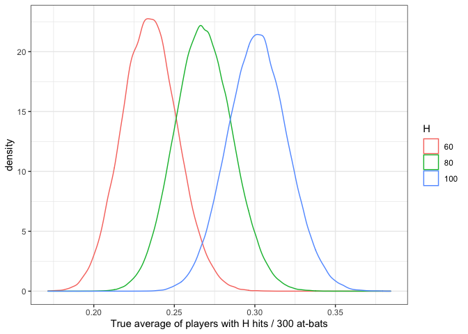

Introduction To Empirical Bayes Notes
================

## Why empirical Bayes?

Empirical Bayesian methods are an approximation to more exact methods,
but come with some controversy. However, EB methods are well suited for
Data Science because

  - Though EB is Inacurate with few observations, with large datasets
    performance can be comperable to traditional Baysiean methods
  - EB provides shortcuts that allow easy computation at scale;
    Approximate in a fraction of the time of full Baysien Methos

We can use EB as a fast approximation technique, when we have many
observations.

## The beta distribution

The *beta distribtion* is a probability distribution with two paramters
\(\alpha\) (alpha) and \(\beta\) (beta). The distribution is constrained
between 0 an 1. In practice, it is good at representing a probabilty
distribution of probabilities.

<!-- -->

## The binomial distribution

The *binomial distribution* models a count of successes out of the
total. To follow the baseball analogy, for 100 at-bats we would say the
number of hits a player will get is distribted according to
`Binomial(100, p)` where `p` is the probability that at-bat `AB` will be
a hit `H`. In the baseball case, the `p` the thing we want estimate is a
batting average.

> Batting Average = Hits / At Bats

## Updating Our Beliefs

We can build an existing belief (prior) regarding what a reasonable
batting average should be. The text suggests that belief is 0.27, with
an alpha = 81, and beta of 219. However, a batting average could
reasonably range from 0.21 to 0.35 (see plot below). So if we start with
this existing belief of where any players true batting average *could
be*, how do we update our prior beliefs based on new information as the
player gets at-bats in.

<!-- -->

This idea, `prior expectations + new information = new expectation` is a
simplificiation of the Bayesian Philosopy. In the case of updating our
beta distribution, the update rule is very simple.

> Beta(alpha0 + hits, beta0 + misses)

So, if a player were to have a hit on their first at

