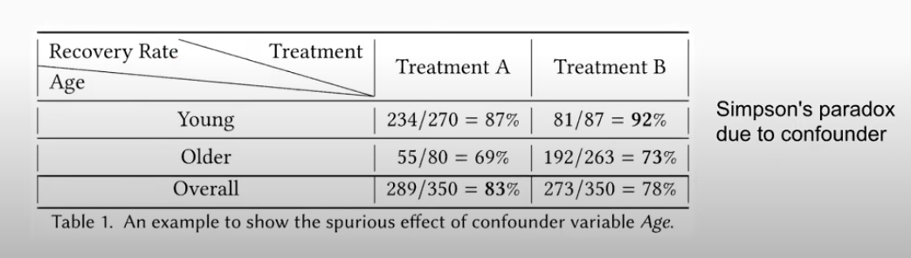
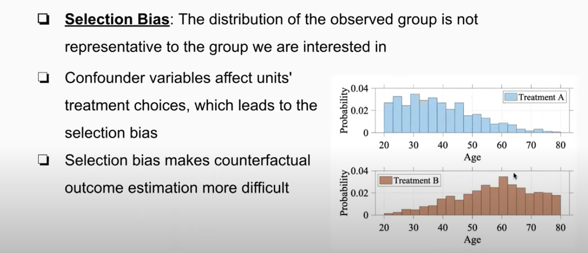

```{r setup, include=FALSE}
knitr::opts_chunk$set(echo = TRUE)
```

## [Overview](https://www.youtube.com/watch?time_continue=39&v=g_2dMQCU0zo&feature=emb_logo)

**Causality** is also referred to as "_causation_" or "_cause and effect_".  

### Correlation does not imply causation

For two correlated events A and B, the **possible relations** might be:

1. A causes B
2. B causes A
3. A and B are consequences of a common cause, but do not cause each other

### Causal Inference and Causal Discovery

- **Causal Discovery** is identifying relationships from large quantities of data through computational methods. The
- **Causal Inference** is the process of drawing a conclusion about a causal connection based on the conditions of the occurrence of an effect.
  - Experimental Study (e.g., randomized controlled trials)
  - Observational Study (e.g., potential outcome framework)

### Experimental Study

- Randomized Control Trial (RCT)
- Assignment to control/treatment is random
- Study the effect of a treatment (e.g., design A/B) to the outcome (e.g., conversion)
- Considered the **Gold-standard** for studying causal relationships
- Expensive and time consuming

### Observational Study

- Unlike RCTs, treatment assignment in observational study is NOT random
- Because it is not random, approaches must remove bias from data, emulating the RCT.
- Popular Approaches: graphical causal models, potential outcome framework
- Simple, efficient
- Potential to leverage large datasets

### Tutorial Objectives

Causal Inference is an active research area with many topics, this tutorial focus on the  **potential outcome framework** in **observational study**. Machine learning could assist causal inference at different stages, in this tutorial we focus on how to design **representation learning** approaches for causal inference.  Relevant resources include:

- A Survey On Causal Inference (02/2020) [arXiv:2002.02770](https://arxiv.org/abs/2002.02770)
- Tutorial Website <http://kdd2020tutorial.thumedialab.com>

## [Causal Inference: Background and Challenges](https://www.youtube.com/watch?v=I6yi_wd4r94)

### Causal Inference Paradigms

- **Graphical Causal Models**
  - Causal graphs are probabilistic graphical models to encode assumptions about data-generating process [Pearl, 2009]
  - Also referred to as Bayesian Network
  - Related approach: structural equation modeling (SEM)
  - The direction of the edges (arrows) implies causality. For instance
    - `X` -> `Y` implies that `Y` will respond to any changes in `X`, or `X` is a cause of `Y`
- **Potential Outcome Framework** <<--
  - An approach to statistical analysis of cause and effect based on potential outcomes [Rubin, 2005]
  - a.k.a., Rubin causal model (RCM), or Neyman-Rubin causal model

### Potential Outcome Framework: Key Terms

- **Unit**: A unit is the atomic research object in the causal study
  - Single object, e.g., a patient or a website visitor
  - A collection of objects, e.g., a group of students
  - This is the individual level of observation for the study

- **Treatment**: An action that applies to a unit
  - In the binary treatment case (i.e., `W = 0` or `W = 1`), the treated group contains units who received treatment `W = 1`, while the control group contains units who received treatment `W = 0`
  - Multiple treatments are possible, not only the binary.  For instance, consider different sizes and content of ads
  
- **Potential Outcome**: For each unit-treatment pair, the outcome of the treatment when applied on that unit is the potential outcome $Y(W=w)$
  - For instance, consider a simple drug trial.  If a patient has a disease and receives a treatement, two potential outcomes could be that the patient is cured of the disease, or that the disease is not cured.

- **Observed (Factual) Outcome**: Outcome of treatment that is actually applied. In the binary case, $Y^F = Y(W = w)$.  This is the observed outcome.

- **Counterfactual Outcome**: Potential outcome of the treatments that were not applied to the unit.  In the binary case, $Y^{CF} = Y( W = 1 - w)$.  This outcome cannot be observed.

- A unit can only take one treatment, The the counterfactual outcomes are not observed, leading to the well-known "missing data problem" [Holland, 1986]

- **Treatment Effects** can be defined at the population, treated group, subgroup and individual levels. (Examples in the binary example)
  - Population Level: Average Treatment Effect (**ATE**)
    - $ATE = \mathbb{E}[Y(W = 1) - Y(W = 0)]$
    - e.g., The difference in mean (average) outcomes between units assigned to the treatment $Y(W = 1)$ and units assigned to the control $Y(W = 0)$
  - Treated Group: Average Treatment Effect on the Treated Group (**ATT**)
    - $ATT = \mathbb{E}[Y(W = 1| W = 1)] - \mathbb{E}[Y(W = 0| W = 1)]$
    - e.g., ATT is the difference between the expected outcome of the treatment group (observed), minus the expected outcome if the same group was not treated (counterfactual)
  - Subgroup: Conditional Average Treatment Effect (**CATE**)
    - $CATE = \mathbb{E}[Y(W = 1)|X = x] - \mathbb{E}[Y(W = 0)|X = x]$
  - Individual: Individual Treatment Effect (**ITE**)
    - $ITE_{i} = Y_{i}(W = 1) - Y_{i}(W = 0)$
    - e.g., on the individual level, what is the expected outcome under the treatment less the outcome with no treatment.
    
### Potential Outcome Framework: An Example

- **Task**: Evaluate the treatment effects of several medications for one disease, by exploiting observational data (i.e., EHR)
- **Observational Data** may include
  1. Demographic data from patients 
  2. Specific medication dosage taken by patients (treatment) `W = 0` or `W = 1`
  3. Outcome of medical tests `Y`
- **Units**: patients
- **Treatments**: different medications
- **Outcome**: recover status, blood test results, etc.

### Potential Outcome Framework: Assumptions

There are three primary assumptions required to leverage this potential outcome framework

#### Assumption: Stable Unit Treatement Value Assumption (SUTVA)

> The potential outcomes for any unit do not vary with the treatment assigned to other units, and, for each unit, there are no different forms or versions of each treatement level, which leads to different potential outcomes.

This assumption emphasizes the:

- **Independence of each unit**, i.e., there are no interactions between units.  In our example, one patient's outcome would not affect other patients' outcomes
- **Single version for each treatment.** For instance, once medicine with different dosage are different treatments under the SUTVA assumption

#### Assumption: Ignorability

> Given the background variable `X`, treatment assignment `W` is independent of the potential outcomes

<p align = "center">$W \perp \!\!\! \perp Y(W = 0), Y(W = 1)|X$<p>

> By randomly assigning treatment, researchers can ensure that the potential outcomes are independent of treatment assignment, so that the average difference in outcomes between the two groups can only be attributable to treatment. This assumption is formally called ignorability.

Following our example, this assumption implies that:

- If two patients have the background variable $X$, their potential outcome should be the **same** whatever the treatment assignment is.
- If two patients have the same background variable value, their **treatment assignment mechanism** should be the same regardless of 

#### Assumption: Positivity

For any set of values of $X$, treatment assignment is not deterministic (e.g., some element of randomness in assignment):

<p align = "center">$P(W = w | X = X) > 0$ $\forall w$ and $x$</p>

> Positivity is the assumption that any individual has a positive probability of receiving all values of the treatment variable: Pr(A=a) > 0 for all values of a. In a randomized controlled trial, positivity holds because you will use a coin that has a positive probability of assigning people to either arm of the trial.

- If treatment assignment for some values of X is deterministic, the outcomes of at least one treatment could never be observed.  It would be unable and meaningless to estimate causal effects
- It implies "common support" or "overlap" of treated and control groups
- When combined with ignorability it is also called **Strong Ignorability** or **Strongly Ignorable Treatment Assignment**

## A Naive Solution

- A core problem to causal inference, how do we estimate the average potential treated/control outcomes over a specific group? 
- A naive solution, calculate the difference between the average treated and control outcomes:

$$\hat{ATE} = \frac{1}{N_{T}}\sum^{N_{T}}_{i=1}{Y^{F}_{i}} - \frac{1}{N_{C}}\sum^{N_{C}}_{j=1}{Y^{F}_{j}}$$
- However, this is not reasonable due to the existence of **confounders**

## Confounders

> In statistics, a confounder is a variable that influences both the dependent variable and independent variable, causing a spurious association. Confounding is a causal concept, and as such, cannot be described in terms of correlations or associations. [Wikipedia: Confounding](https://en.wikipedia.org/wiki/Confounding)

- **Confounders**: Variables that affect both treatment assignment and outcome
- In the example below, **age** is a confounder
  - Age affects recovery rate
  - Age also affects the choice of treatment
  


## Selection Bias With Confounders



## Key Terms

- **Causal Graph / Bayesian Network:** in statistics, econometrics, epidemiology, genetics and related disciplines, causal graphs (also known as path diagrams, causal Bayesian networks or DAGs) are probabilistic graphical models that represents a set of variables and their conditional dependencies via a directed acyclic graph (DAG). Bayesian networks are ideal for taking an event that occurred and predicting the likelihood that any one of several possible known causes was the contributing factor. For example, a Bayesian network could represent the probabilistic relationships between diseases and symptoms. Given symptoms, the network can be used to compute the probabilities of the presence of various diseases. [Wikipedia: Bayesian Network](https://en.wikipedia.org/wiki/Bayesian_network)

## External Refernces

- [Pearl, 2009] Judea Pearl. _Causality_. Cambridge University Press, 2009.
- [Rubin, 2005] Donald Rubin. Causal inference using potential outcomes. _Journal of the American Statistical Association_, 2005.
- [Holland, 1986] P. Holland, "Statistics and causal inference." _Journal of the American Statistical Association_, 81.396 (1986): 945-960.

## Tutorial Resources

- [Session 1 of 6: Overview](https://www.youtube.com/watch?time_continue=39&v=g_2dMQCU0zo&feature=emb_logo)
- [Session 2 of 6: Causal Inference: Background and Challenges](https://www.youtube.com/watch?v=I6yi_wd4r94)
- [Session 3 of 6: Classical Causal Inference Methods](https://www.youtube.com/watch?time_continue=4&v=f2dvVpDxD3A&feature=emb_logo)
- [Session 4 of 6: Subspace Learning For Causal Inference](https://www.youtube.com/watch?time_continue=1&v=J4B00WZH5A0&feature=emb_logo)
- [Session 5 of 6: Deep Representation Learning For Causal Inference](https://www.youtube.com/watch?v=_DwdpmZkY1M&feature=emb_logo)
- [Session 6 of 6: Applications and Potential Directions](https://www.youtube.com/watch?time_continue=1&v=roVS6LQS6tk&feature=emb_logo)
- A Survey On Causal Inference (02/2020) [arXiv:2002.02770](https://arxiv.org/abs/2002.02770)
- Tutorial Website <http://kdd2020tutrorial.thumedialab.com/>

## Tutors

- Peng Cui (Tsinghua University); 
- Zheyan Shen(Tsinghua University); 
- Sheng Li (University of Georgia); 
- Liuyi Yao (University at Buffalo, USA); 
- Yaliang Li (Alibaba Group); 
- Zhixuan Chu (University of Georgia ); 
- Jing Gao (University at Buffalo)
