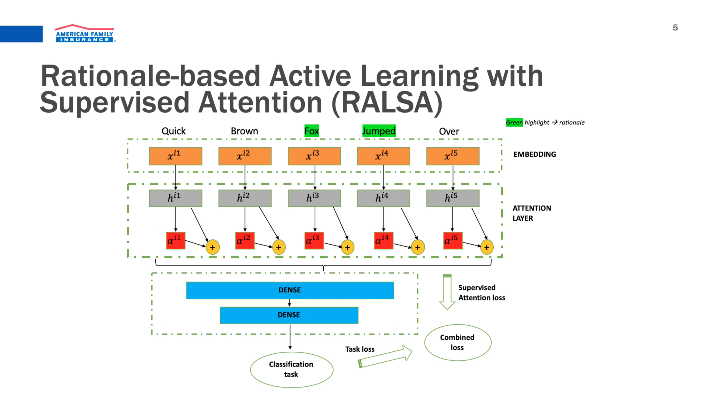

# KDD 2020: Data Science With Human In The Loop

Notes on the [Workshop on Data Science with Human-in-the-loop (DaSH)](https://sites.google.com/view/dash2020/home?authuser=1).  Links to full text of papers are available on the [program page](https://sites.google.com/view/dash2020/program?authuser=1)

## Session 1: [Human in the Loop Techniques](https://sites.google.com/view/dash2020/program?authuser=1#h.jvlywq17gg3i)

---

### Active Learning++: Incorporating Annotator’s Rationale using Local Model Explanation

> Bhavya Ghai, Q. Vera Liao, Yunfeng Zhang and Klaus Mueller. Active Learning++: Incorporating Annotator’s Rationale using Local Model Explanation

Rather than relying solely on the labels provided by the **oracle** how can we incorporate the **rationale** for their label into the workflow?

When taking in the **oracle** labels

- (Elicit Rationale) Ask a user to force rank features that were most important to their label.
- (Training) - Bagging Strategy Based on QUery By Committee, with modification on disagreement measure
   1. Sample from labeled data sets `n` times
   2. Train `n` models as your _Committee of Classifiers_
   3. Use Committee to determine labels for unlabeled `X`
   4. Calculate a measure of disagreement, i.e., how much to models agree vs. disagree on a given label
      - For AL++; you apply a weight to the disagreements, where if a model prioritizes the same features as the oracle, it is given a higher weight.
   5. selecting the `X` with highest weighted disagreement to prioritized for the next round of oracle labeling
- Rinse & Repeat

**So what?**

- Potentially reduce labeling costs.  We want to make better use of the **oracle**'s.
- Incorporation of rationale seems relevant.  Would like to see it applied to larger, non-UCI dataset(s)

### An Intuitive User Interface for Human-in-the-loop Entity Name Parsing and Entity Variant Generation

> Kun Qian, Lucian Popa and Yunyao Li. An Intuitive User Interface for Human-in-the-loop Entity Name Parsing and Entity Variant Generation

Built a system for comparing multiple interfaces on teh same date-parsing, oracle task.  Comparing the number of clicks, number of annotations, and F1 score.  [DEMO](https://www.youtube.com/watch?v=Q1zgmZCOs6A&feature=youtu.be)

#### **So what?**

- The cost of human-in-the-loop systems is typically measured in the number of labels.
- This ignores the effort associated with making the label.
- Value prop is still the same; Use the resource of human time more efficiently.
- Highlights the importance of design an Usability in the space.

---

### Human-In-The-Loop Topic Discovery with Embedded Text Representations

[Video](https://vimeo.com/445889795) | [Paper](https://drive.google.com/file/d/1c1JU5qABu_WtKcV-u3OIz-HbHUvHUYC0/view) | [Repo](https://github.com/AmFamMLTeam/hltm_welda) | [Team](https://www.ai-ml-amfam.com)

> Eric Bunch, Qian You and Glenn Fung. Human-In-The-Loop Topic Discovery with Embedded Text Representations

Presenter is from an insurer, American Family Insurance, supporting business operations.  Much of their work involves:

- Dealing with Unstructured Text (i.e., claims documents)
- Documents must be routed to the right resource (fire, theft, etc.)
  - This is a topic modeling exercise
  - Current workflow requires costly manual inspection, and rough keyword matching
- Developed tool for topic discovery in a corpus of documents

Their proposal WELDA (Word Embeddings Latent Dirichlet Allocation), combine three things:

1. Latent Dirichlet allocation (LDA)
    - OG Limitation: LDA is static, and must be refit when there are alterations
    - OG Limitation: LDA does not incorporate external knowledge or data
    - Uses Collapsed Gibs-sampling to allow the internal state to be modified in ways that would reflect normal usage, i.e., a user changed this word, or added this sentence.
2. Word Embeddings
3. Human-In-The-Loop

WELDA alternates between iterations of Gibbs Sampler, and randomly replacing words based on distribution over the Word2Vec embeddings space, based on current topic assignments.  Human [provided a tool](<https://github.com/AmFamMLTeam/hltm_welda>) in which they can take multiple actions.  Tool lead to single topic assignment

#### **So what?**

- Same constraints, user time.
- Combines Multiple Techniques, and provides a tool with which to experiment

---

### Rationale-based Human-in-the-Loop via Supervised Attention

[Video](https://vimeo.com/445889811) | [Paper](https://drive.google.com/file/d/1t5YtwBpXGt2nYIh3-h1pnp8i-qwxTmF5/view) | [Team](https://www.ai-ml-amfam.com)

> Teja Kanchinadam, Keith Westpfahl, Qian You and Glenn Fung. [Rationale-based Human-in-the-Loop via Supervised Attention](https://drive.google.com/file/d/1t5YtwBpXGt2nYIh3-h1pnp8i-qwxTmF5/view)

Additional topic from, American Family Insurance.  Dealing with similar problems as above:

- Company deals with lots of unstructured data
- Annotation is expensive
- Goal is to minimize the amount of feedback

Process:

1. Document picked from corpus
2. Given to Annotator, then annotator
    - Assigns a label
    - Highlights important phrases (provides rationale)

Two novel incorporations; one with linear model; another with NN.

---

## Sesssion 2: [Model Analysis and Applications](https://sites.google.com/view/dash2020/program?authuser=1#h.7h62n8ow427y)

### WhyFlow: Explaining Errors in Data Flows Interactively

[Video](https://vimeo.com/445889973) | [Paper](https://drive.google.com/file/d/1EROo3fYk8E1fnX5vBtB1TYtfs_PWsX-N/view) | [Speaker](https://www.google.com/search?q=nyu+whyflow&oq=nyu+whyflow&aqs=chrome..69i57.2685j0j7&sourceid=chrome&ie=UTF-8)

> Maeda Hanafi, Azza Abouzied, Marina Danilevsky and Yunyao Li. WhyFlow: Explaining Errors in Data Flows Interactively

- User case; Business application sees errors at point of end-user interaction.
- Determining where in code error occurred is difficult, and time cosuming, and full process may not be owned or known by a single user.
  - "Determining Providence For The Error"
- Given error conditions in end state
  - Builds view out of each code module with explainable predicates that correspond with output
  - In other words, it ids data conditions that caused failure, and tries to highlight
- Potentially useful for data pipeline Management
  - reduce time spent debugging data pipeline problems
  - help address complexity of pipelines
  
Note: Unable to find any open source tooling, likely in hands of IBM research.

### Towards a What-If System for Point-Of-Interest Categorisation

[Video](https://vimeo.com/445889927) | [Paper](https://europe.naverlabs.com/research/publications/point-of-interest-categorisation-towards-putting-the-human-back-in-the-loop/)

> Nikolaos Lagos, Jose Miguel Perez, Michel Langlais and Adrian Mos. Towards a What-If System for Point-Of-Interest Categorisation

- Consider map recommendations based on location; Restaurant near Eiffel tower
  - Recommendations may be incomplete (new restaurant), inaccurate (hours of operation), or otherwise not matching the category based on culture or geo (tapas may be breakfast in spain, but not in US) 
- The two axes to explore are geography, and time...
  - Goal: Exploring mechanisms to move away from expert-based rules systems, so active learning
- Use cases primarily in industries with physical locations, or mapping.

### InMacs: Interactive modeling and comparison of sentiments from sequence data

> Subhajit Das and Florina Dutt. InMacs: Interactive modeling and comparison of sentiments from sequence data

### Names Don't Fly: Smart Filters for Profanity Detection and Classification in User-Generated Content

> Hamsa Shwetha Venkataram, Ian Colwell, Steven Liu, Philip Southam, Chris Mattmann and Tomas Soderstrom. Names Don't Fly: Smart Filters for Profanity Detection and Classification in User-Generated Content

---

## [Session 3: Impact of Data Science and Automation](https://sites.google.com/view/dash2020/program?authuser=1#h.ske8vnik3u51)

### Cultivating Human Expertise Through AI-Assisted Data Science

> Josh Andres, Christine Wolf, Michael Muller, Justin Weisz, Narendra Nath Joshi, Aabhas Sharma, Krissy Brimijoin, Michael Desmond, Zahra Ashktorab, Qian Pan, Evelyn Duesterwald and Casey Dugan. Cultivating Human Expertise Through AI-Assisted Data Science

### The Next Decade of Data Science

> Justin Weisz and Michael Muller. The Next Decade of Data Science

### Data Scientists and Designers Can Create The Jobs of The Future

> Diarmuid Cahalane, Patrick Connolly, Andrew Dalton, Bogdan Saceleanu and Medb Corcoran. Data Scientists and Designers Can Create The Jobs of The Future

### IBM AutoAI: Human-in-the-Loop Automated Machine Learning  Supports Data Scientists to Build Better Models

> Dakuo Wang, Josh Andres, Justin Weisz, Erick Oduor, Udayan Khurana, Horst Samulowitz, Arunima Chaudhary, Abel Valente, Dustin Torres and Casey Dugan. IBM AutoAI: Human-in-the-Loop Automated Machine Learning  Supports Data Scientists to Build Better Models

---

## Key Terms

- **Active Learning**: Special case of semi-supervised learning, where an machine learning algorithm can interactively query from a user, or otherwise get new information.  Information source is often referred to as the **teacher** or **oracle**.

- **Latent Dirichlet allocation (LDA)** - Bayesian topic modeling technique that takes a corpus of documents and models a latent set of topics.

## Related Resources

- [[nextml/NEXT](https://github.com/nextml/NEXT)]: NEXT is a web-framework to develop, evaluate, and apply active learning.
- [[AmFamMLTeam/hltm_welda](https://github.com/AmFamMLTeam/hltm_welda)]: Human in the Loop Topic Model with Word Embedding Latent Dirichlet Allocation (HLTM-WELDA).