```{r setup, include=FALSE}
knitr::opts_chunk$set(echo = TRUE)
```

## Module 2: Overview Big Data Pipeline on AWS

Breaking down the Big Data Pipeline, the major categories are.

- Data Ingestion
- Data Storage
- Data Processing
- Data Visualization

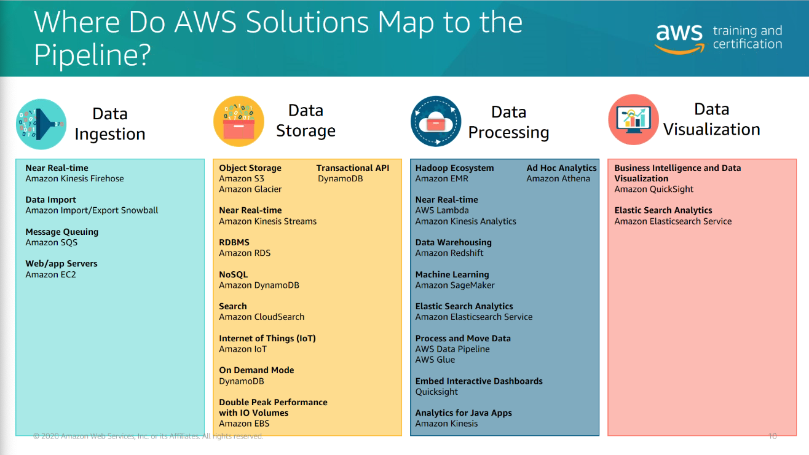

What about open source?

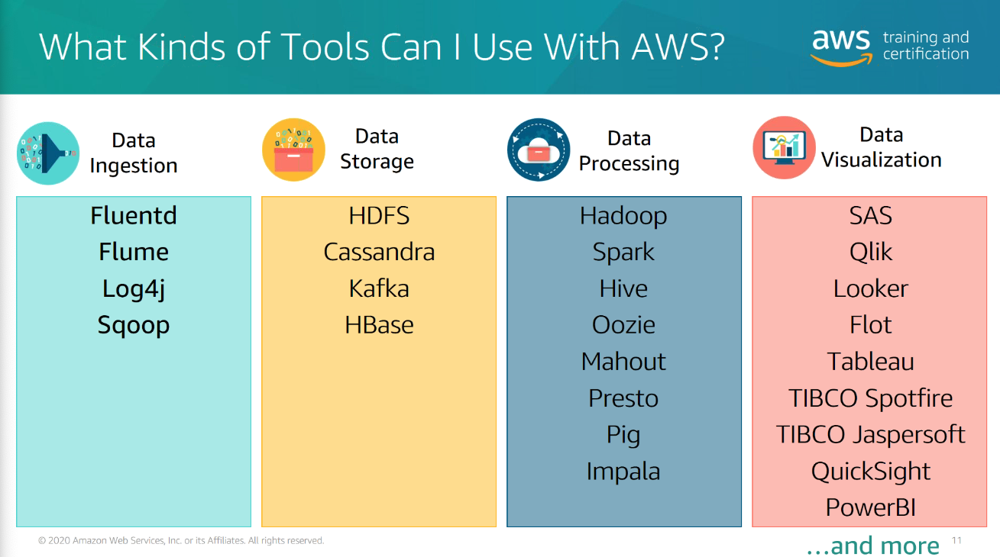
### Decoupling The Data Bus

> In computer architecture, a bus (a contraction of the Latin omnibus, and historically also called data highway) is a communication system that transfers data between components inside a computer, or between computers.

Decoupling each of the components of the pipeline allows for swapping out components, some considerations include:

- Data Structure
- Latency
- Throughput
- Access Patterns

## Module 3: Big Data Ingestion and Transfer

Data collection is done for the purposes of transfer and storage. Two approaches discussed

### Types of Data Ingestion

- Transactions: need to quickly store and retrieve small pieces of data.  Think database reads/writes (AWS RDS)
- File: typical one-way transfer, SAL not as fast as transactional data.  On AWS typically stored in S3
- Streaming: streaming events come in real-time, require flexible high-volume ingestion.  Think click logs, or other frequent on-site events.  On AWS handled by things like Kinesis

### AWS Data Transfer Options

Depends on the size, frequency of data you want to move.

- VPN Connection
  - Connect between networks; 1.25 Gbps limit per tunnel
- AWS Direct Connect
  - Dedicated connection between networks.
- Database Migration Tools
- AWS S3 - multipart upload
  - Large file transfer; can be with other tools listed above
- AWS Snowball & Snowball Edge
  - Suitcase Size - Storage & Compute - (Snowball Edge)
  - Tractor Trailer Size (AWS Snowmobile) 
  
### AWS IoT

Suite of tools dedicated to IoT.

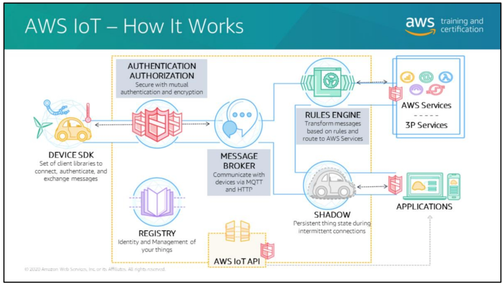
### Real Time Data Ingestion
  
Why do we need it? Data growth is such that data ingestion processes must scale.  Much of growth is in unstructured data.  Batch processing is ill-suited to the 'store-then-process' model?

### Why consider streaming solutions?

- Decouple Collection & Processing
- Collect Multiple Streams Together
- Preserve Client Ordering
- Parallel Consumption

### Other Features Of Stream Processing

- Low Latency
- Guaranteed Message Delivery
- Allows for [Lambda architecture implementation](https://en.wikipedia.org/wiki/Lambda_architecture)
- Permits state management of stream data
- Time or count-based windowing support
- Fault tolerant

### Types of windowing

- Fixed
- Sliding
- Session

### Kinesis

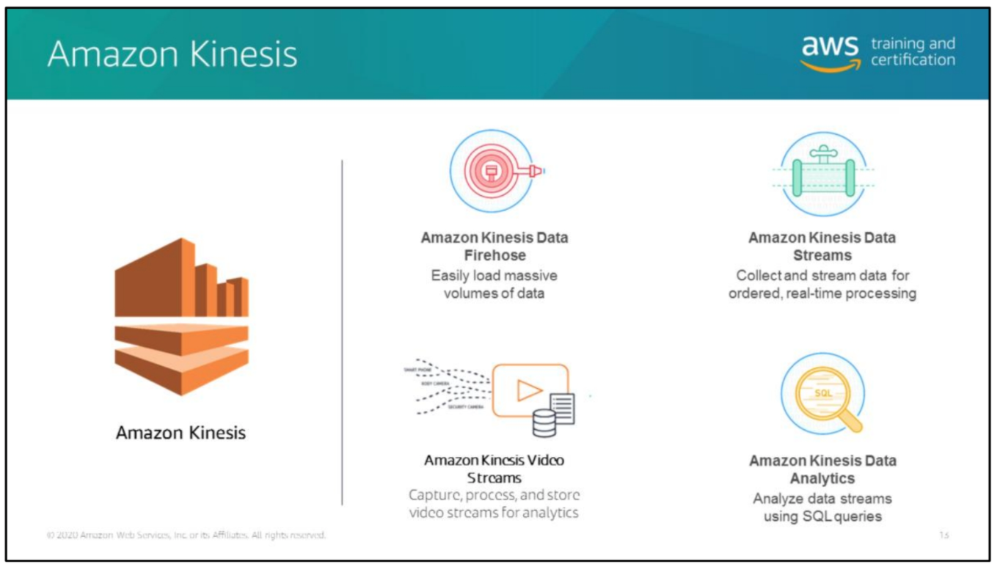

Different use-case, different tools

#### Tool: Kinesis Firehose

- Capture, transform (via AWS Lambda) into S3, Redshift, Elasticsearch, and others
- Enable quick (minimum 60 seconds) data load into downstream sources 
- Can batch, compress, and encrypt before loading it
- Has no storage of its own

Key Concepts:

- Data Producer: Sends data to system (i.e., web server)
- Buffer Size or interval - size or period in which firehose will buffer incoming stream data before delivering
  
#### Tool: Kinesis Data Streams

- Near-Real-time performance (>2ms)
- Quickly scalable
- Can be cost efficient, function of CPU time, and payload size
- Can temporarily retain immutable data (up to 7 days)
  - Consumers of this data can be confident that data is not changed

Requires administration to optimize based on needs. limits on read/write rate
- number of shards (each shard can ingest 1 MB/s)
- Consumers can read at 2MB/s

#### Tool: Kinesis Video Streams

Fully managed AWS service for using live video. As with others, data can be consumed in Batch or continuously

#### Tool: Kinesis Data Analytics

- Apply SQL To Kinesis data streams
- send processed data to analytics tools
- Scales to usage

## Module 4: Big Data Storage Solutions

One size does not fit all.  Know your use-case before selecting the 'right' tool.

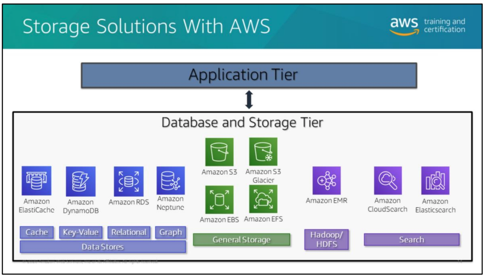

### Key Concepts: Data Lake

> A data lake allows an organization to store all of their data, structured and unstructured, in one centralized repository. Because data can be stored as-is, there is no need to convert it to a predefined schema and you don’t need to know what questions you want to ask of your data before it is stored.

Benefits:

- Centralized Storage
- Ingestion without predefined schema (schema is on read)
- Separate storage and compute

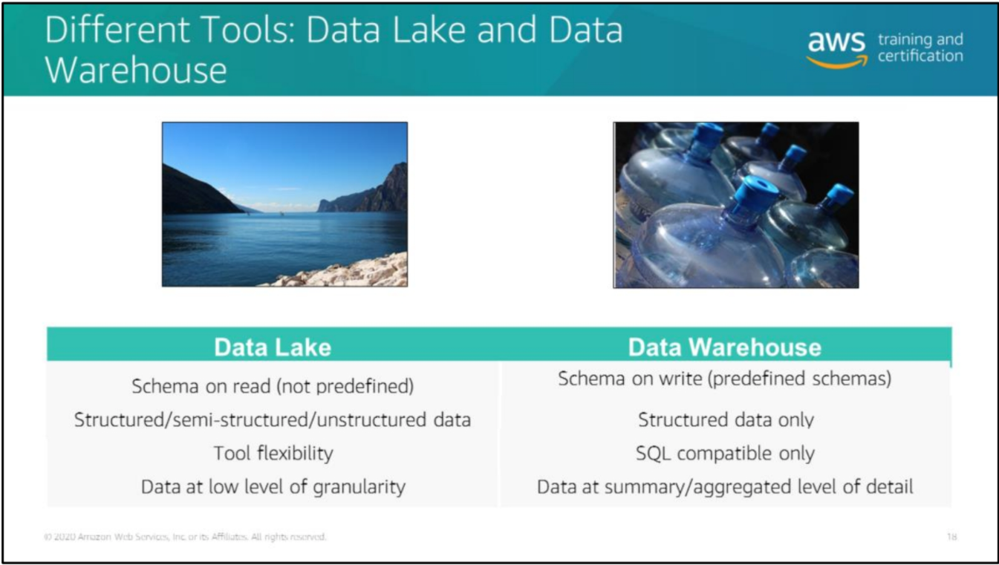 

S3 is recommended tool for this in the training.  

- High availability
- High Performance
- Easy to use (simple REST API, other SDKs)
- Scalable
- Integrated with other services

### Key Concepts: NoSQL DB

> NoSQL databases (aka "not only SQL") are non tabular, and store data differently than relational tables. NoSQL databases come in a variety of types based on their data model. The main types are document, key-value, wide-column, and graph. They provide flexible schemas and scale easily with large amounts of data and high user loads.

- Schema-less
- Eventually sonsistent
- Distributed
- Horizontally Scalable

Again, not every job is created equally.

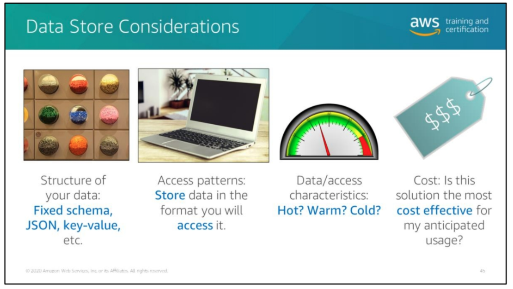

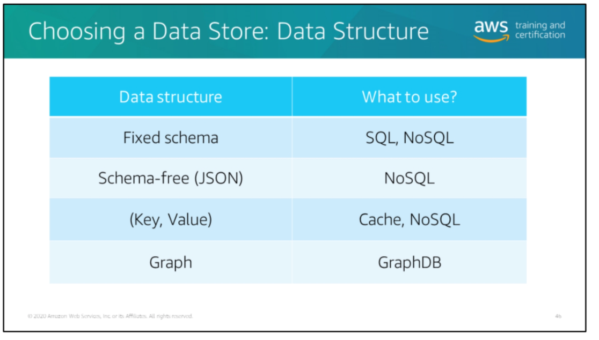

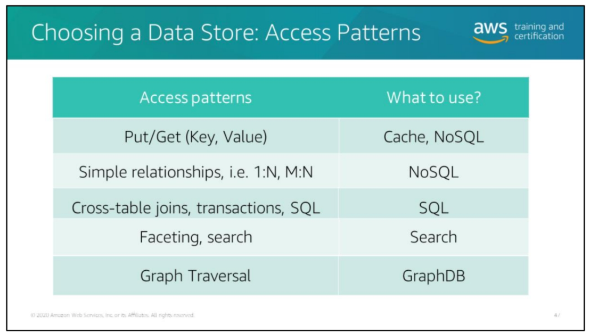

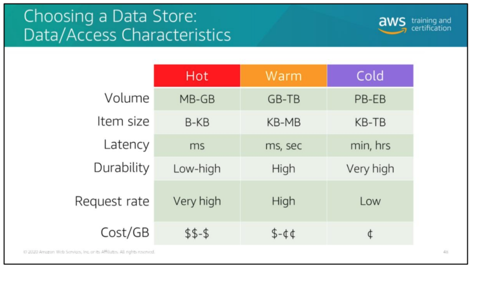

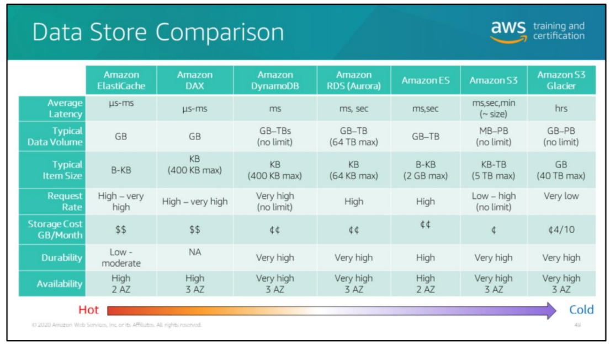

