Big Data On AWS
================

-   [Module 2: Overview Big Data Pipeline on
    AWS](#module-2-overview-big-data-pipeline-on-aws)
-   [Module 3: Big Data Ingestion and
    Transfer](#module-3-big-data-ingestion-and-transfer)
    -   [Types of Data Ingestion](#types-of-data-ingestion)
    -   [AWS Data Transfer Options](#aws-data-transfer-options)
    -   [AWS IoT](#aws-iot)
    -   [Why consider streaming
        solutions?](#why-consider-streaming-solutions)
    -   [Other Features Of Stream
        Processing](#other-features-of-stream-processing)
    -   [Types of windowing](#types-of-windowing)
    -   [Kinesis](#kinesis)
-   [Module 4: Big Data Storage
    Solutions](#module-4-big-data-storage-solutions)
    -   [Key Concepts: Data Lake](#key-concepts-data-lake)
    -   [Key Concepts: NoSQL DB](#key-concepts-nosql-db)

Module 2: Overview Big Data Pipeline on AWS
-------------------------------------------

Breaking down the Big Data Pipeline, the major categories are.

-   Data Ingestion
-   Data Storage
-   Data Processing
-   Data Visualization

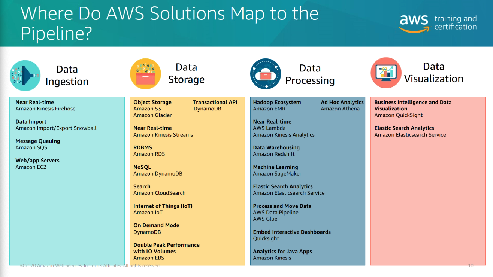

What about open source?

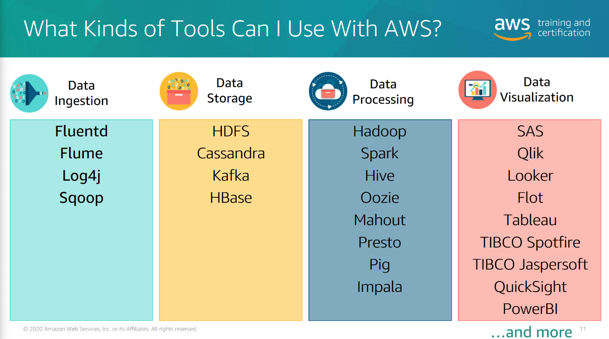 \#\#\# Decoupling The Data
Bus

> In computer architecture, a bus (a contraction of the Latin omnibus,
> and historically also called data highway) is a communication system
> that transfers data between components inside a computer, or between
> computers.

Decoupling each of the components of the pipeline allows for swapping
out components, some considerations include:

-   Data Structure
-   Latency
-   Throughput
-   Access Patterns

Module 3: Big Data Ingestion and Transfer
-----------------------------------------

Data collection is done for the purposes of transfer and storage. Two
approaches discussed

### Types of Data Ingestion

-   Transactions: need to quickly store and retrieve small pieces of
    data. Think database reads/writes (AWS RDS)
-   File: typical one-way transfer, SAL not as fast as transactional
    data. On AWS typically stored in S3
-   Streaming: streaming events come in real-time, require flexible
    high-volume ingestion. Think click logs, or other frequent on-site
    events. On AWS handled by things like Kinesis

### AWS Data Transfer Options

Depends on the size, frequency of data you want to move.

-   VPN Connection
    -   Connect between networks; 1.25 Gbps limit per tunnel
-   AWS Direct Connect
    -   Dedicated connection between networks.
-   Database Migration Tools
-   AWS S3 - multipart upload
    -   Large file transfer; can be with other tools listed above
-   AWS Snowball & Snowball Edge
    -   Suitcase Size - Storage & Compute - (Snowball Edge)
    -   Tractor Trailer Size (AWS Snowmobile)

### AWS IoT

Suite of tools dedicated to IoT.

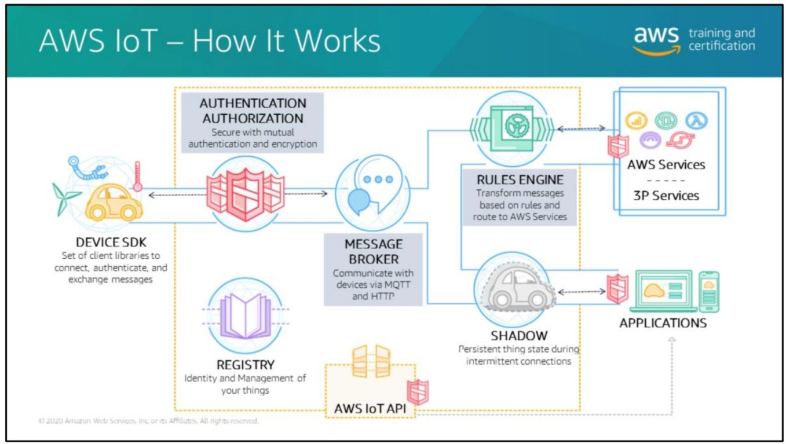 \#\#\# Real Time Data Ingestion

Why do we need it? Data growth is such that data ingestion processes
must scale. Much of growth is in unstructured data. Batch processing is
ill-suited to the ‘store-then-process’ model?

### Why consider streaming solutions?

-   Decouple Collection & Processing
-   Collect Multiple Streams Together
-   Preserve Client Ordering
-   Parallel Consumption

### Other Features Of Stream Processing

-   Low Latency
-   Guaranteed Message Delivery
-   Allows for [Lambda architecture
    implementation](https://en.wikipedia.org/wiki/Lambda_architecture)
-   Permits state management of stream data
-   Time or count-based windowing support
-   Fault tolerant

### Types of windowing

-   Fixed
-   Sliding
-   Session

### Kinesis

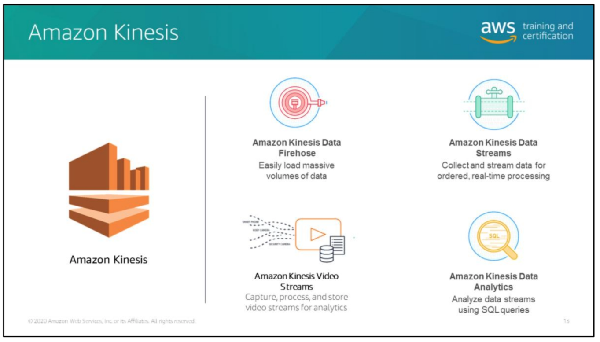

Different use-case, different tools

#### Tool: Kinesis Firehose

-   Capture, transform (via AWS Lambda) into S3, Redshift,
    Elasticsearch, and others
-   Enable quick (minimum 60 seconds) data load into downstream sources
-   Can batch, compress, and encrypt before loading it
-   Has no storage of its own

Key Concepts:

-   Data Producer: Sends data to system (i.e., web server)
-   Buffer Size or interval - size or period in which firehose will
    buffer incoming stream data before delivering

#### Tool: Kinesis Data Streams

-   Near-Real-time performance (&gt;2ms)
-   Quickly scalable
-   Can be cost efficient, function of CPU time, and payload size
-   Can temporarily retain immutable data (up to 7 days)
    -   Consumers of this data can be confident that data is not changed

Requires administration to optimize based on needs. limits on read/write
rate - number of shards (each shard can ingest 1 MB/s) - Consumers can
read at 2MB/s

#### Tool: Kinesis Video Streams

Fully managed AWS service for using live video. As with others, data can
be consumed in Batch or continuously

#### Tool: Kinesis Data Analytics

-   Apply SQL To Kinesis data streams
-   send processed data to analytics tools
-   Scales to usage

Module 4: Big Data Storage Solutions
------------------------------------

One size does not fit all. Know your use-case before selecting the
‘right’ tool.

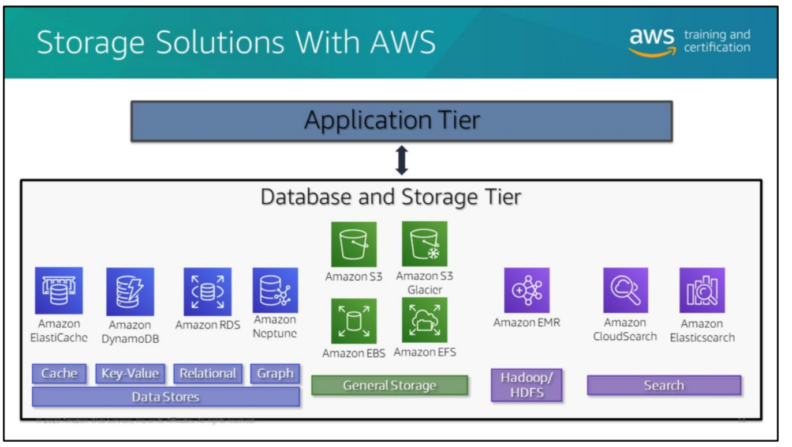

### Key Concepts: Data Lake

> A data lake allows an organization to store all of their data,
> structured and unstructured, in one centralized repository. Because
> data can be stored as-is, there is no need to convert it to a
> predefined schema and you don’t need to know what questions you want
> to ask of your data before it is stored.

Benefits:

-   Centralized Storage
-   Ingestion without predefined schema (schema is on read)
-   Separate storage and compute

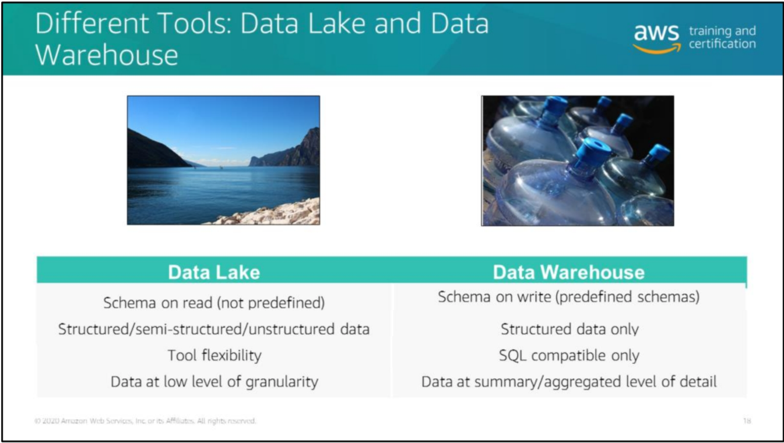

S3 is recommended tool for this in the training.

-   High availability
-   High Performance
-   Easy to use (simple REST API, other SDKs)
-   Scalable
-   Integrated with other services

### Key Concepts: NoSQL DB

> NoSQL databases (aka “not only SQL”) are non tabular, and store data
> differently than relational tables. NoSQL databases come in a variety
> of types based on their data model. The main types are document,
> key-value, wide-column, and graph. They provide flexible schemas and
> scale easily with large amounts of data and high user loads.

-   Schema-less
-   Eventually sonsistent
-   Distributed
-   Horizontally Scalable

Again, not every job is created equally.

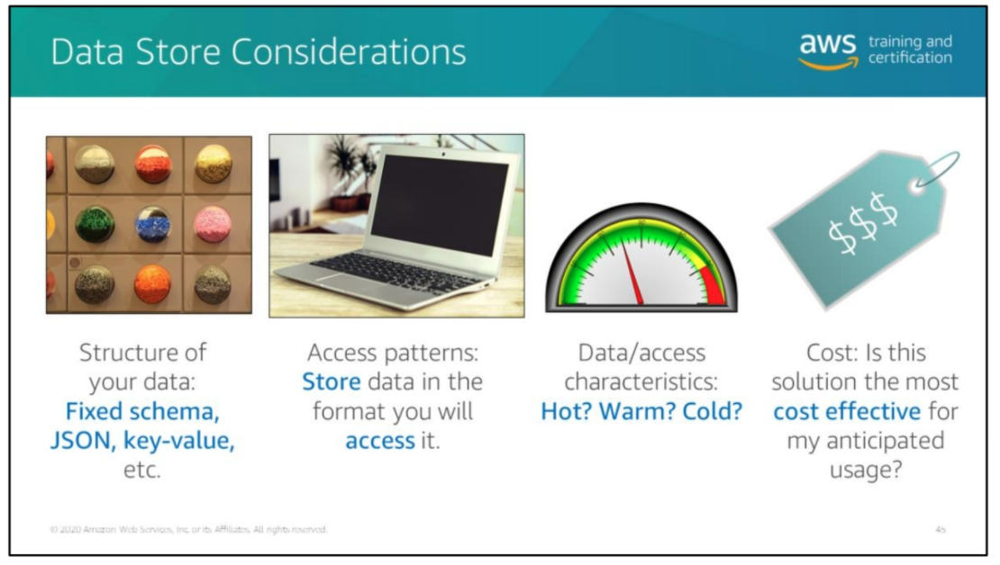

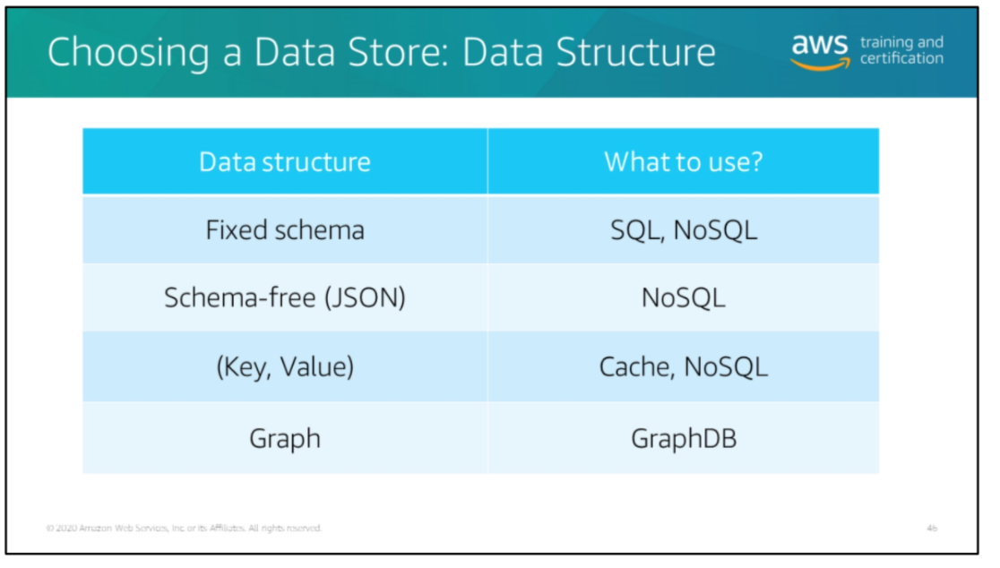

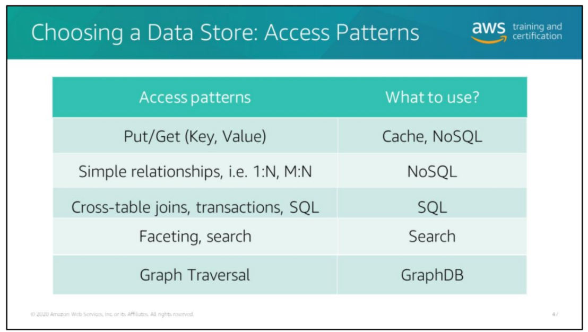

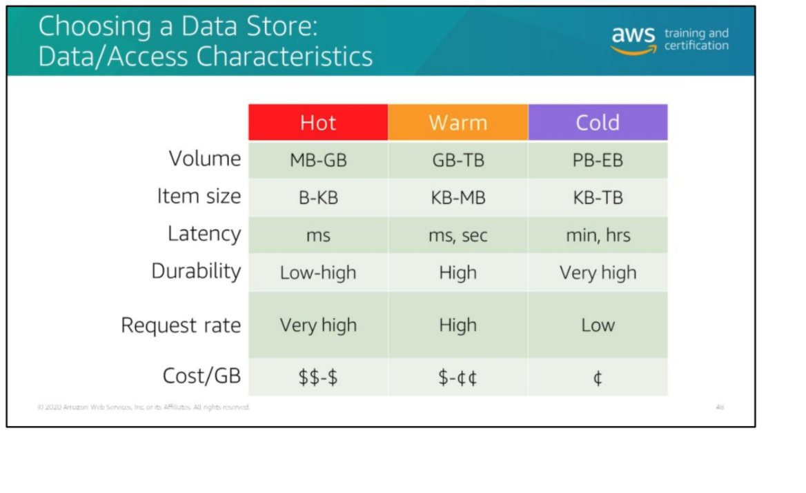

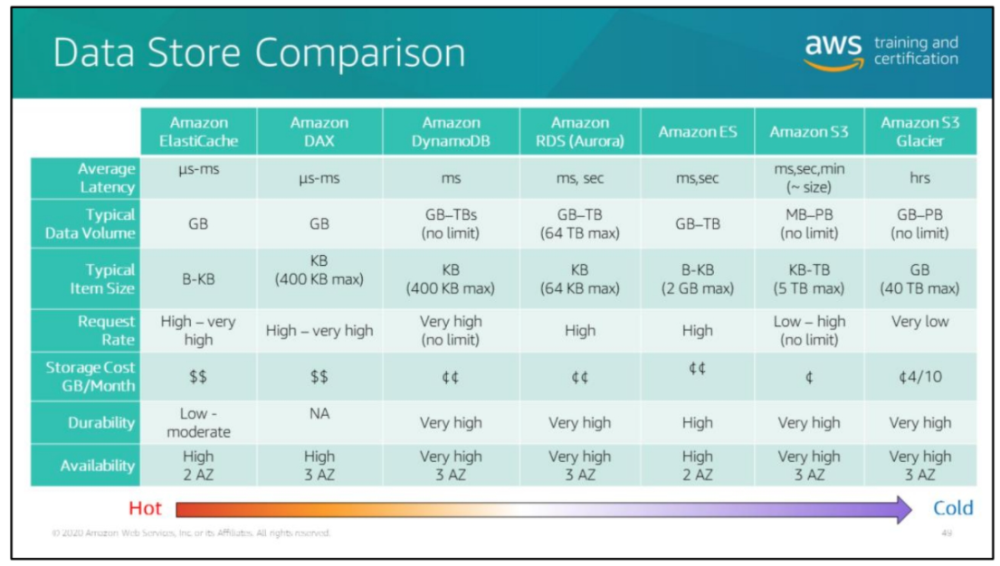
