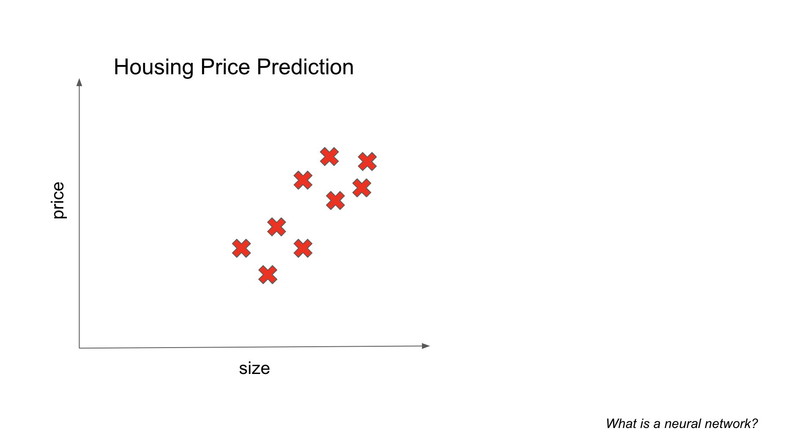
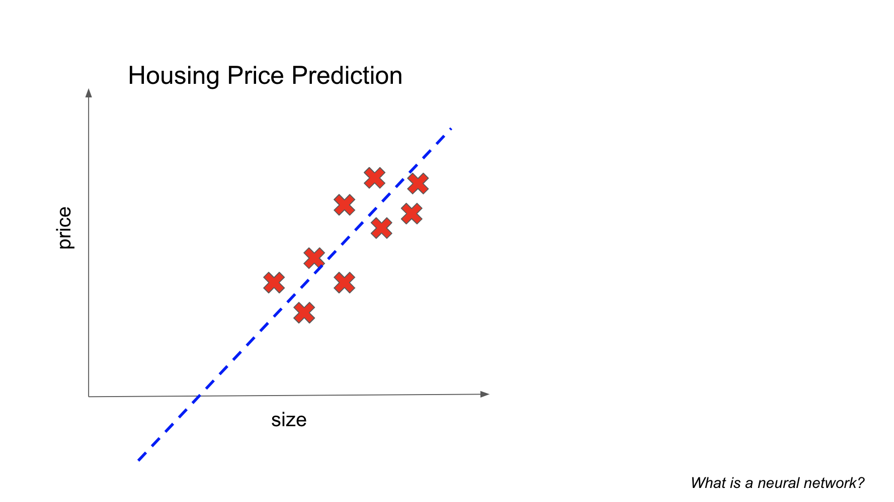
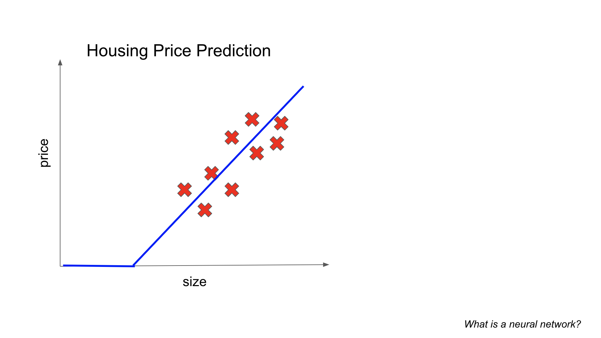
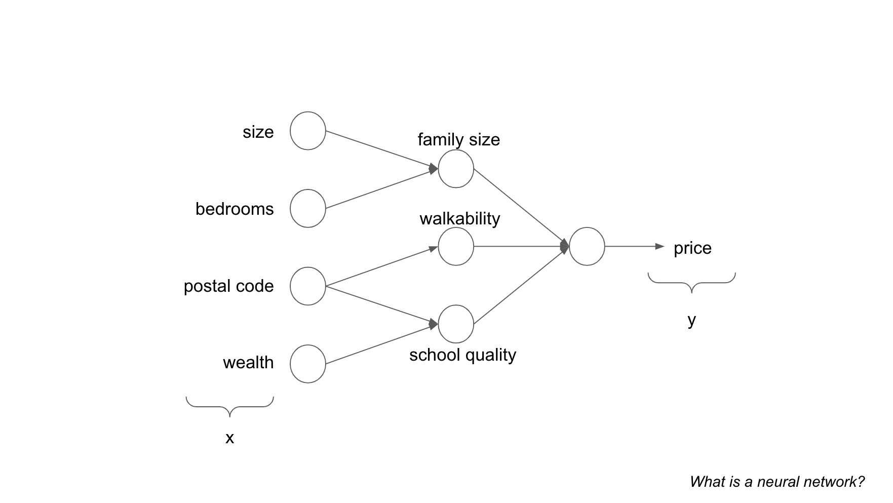
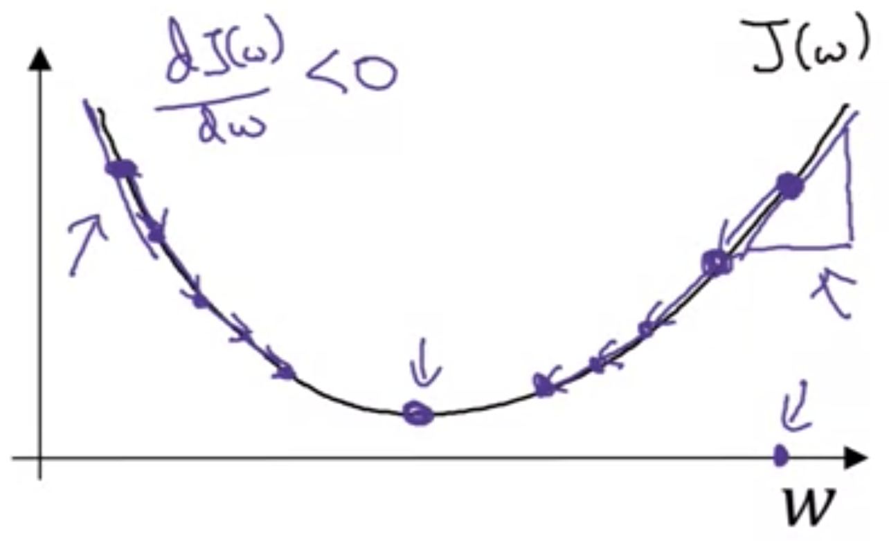
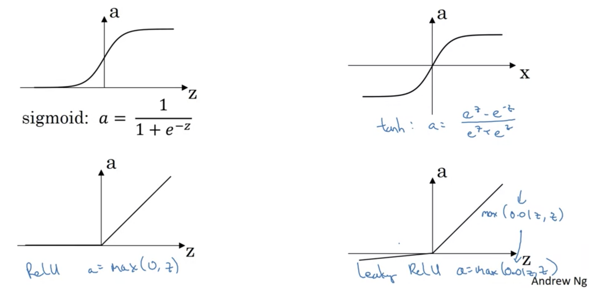
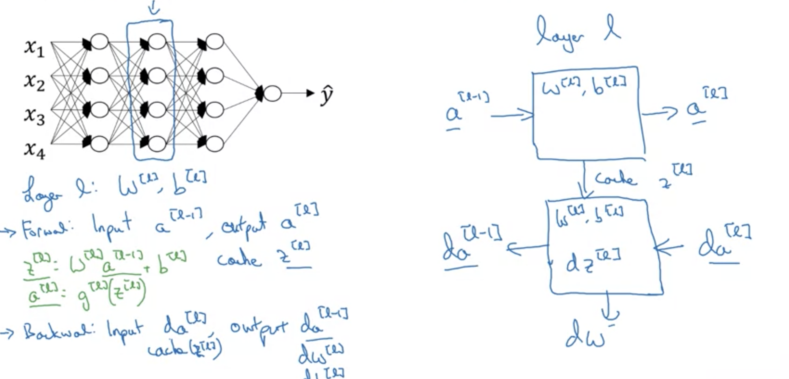

Neural Networks and Deep Learning
================
Brandon Beidel
2020/05/15

## Week 1: [Introduction to deep learning](https://www.coursera.org/learn/neural-networks-deep-learning/home/week/1)

### Key Concepts

  - Understand the major trends driving the rise of deep learning.
  - Be able to explain how deep learning is applied to supervised
    learning.
  - Understand what are the major categories of models (such as CNNs and
    RNNs), and when they should be applied.
  - Be able to recognize the basics of when deep learning will (or will
    not) work well.

-----

class: center middle inverse

## What is a neural network?

Objective: Use a simple example to provide an intuition around what a
neural network is.

-----

## Predicting Home Sale Price



Consider a dataset of home prices; we have many attributes.

  - square footage
  - zip code
  - bedrooms
  - bathrooms

Can we build a model that will help predict the outcome price?

-----

## Applying Linear Regression



  - simplistic approach: we could apply linear fit on the size of home
    v. price
  - limitations: negative, predicted prices

-----

## What about non-linearity?



  - What if we make a simple rule, we won’t accept negative prices out
    of the model, so an output of zero.
  - Our model is no longer linear, but it provides something more
    realistic, still not perfect

-----

## A single “neuron” model


  - In the simplest sense, we have created a model with a single
    ‘neuron’
  - To generate a prediction, the neuron:
      - takes in data inputs
      - applies a function
      - takes the output and uses an “activation” function; transforming
        the result
      - the final activated result is returned from neuron
  - ReLU is an example of a potential “activation” function;
  - sigmoid is an alternative;
      - 2 horizontal asymptotes at 0 and 1, long S curve from 0 to 1;
  - Activation functions have an impact on things such as the learning
    rate; more detail later

-----

## Combining Neurons into Neural Networks (Intuition)



Consider composite features, features not available in the raw dataset,
but manufactured by the user. Each is a function of “upstream” raw
inputs.

  - family size = function(size, bedrooms)
  - walk-ability = function(postal code)
  - school quality = function(postal code, wealth)

We may have a belief that we can build interpret-able features, with
inputs and outputs of these neurons; the production of one neuron feeds
into the next “layer” of neurons.

-----

## Combining Neurons into Neural Networks (Reality)


  - In Deep Neural Networks (DNN); we don’t have that manual control, or
    interpret-ability instead:
      - Each neuron connects to all neurons in the layer below; -
        Densely connected
          - each layer below is a “hidden unit.”
      - the network is allowed to determine “what is important?”
      - you only need to provide the inputs “x” and outputs “y” for
        observations

-----

## Supervised Applications of Neural Networks

| Input (x)        | Output (y)            | Application        | NN Configuration |
| ---------------- | --------------------- | ------------------ | ---------------- |
| House Attributes | Home Price            | Real Estate        | Standard NN      |
| Ad, User Info    | Will user click?      | Advertising        | Standard NN      |
| Image            | Array of Pixel values | Object Detection   | Convolutional NN |
| Audio Recording  | Written Transcript    | Speech Recognition | Recurrent NN     |
| English Text     | Chinese Text          | Translation        | Recurrent NN     |
| Image, Radar     | Position of a car(s)  | Autonomous Driving | Custom/Hybrid    |

  - Neural Networks have applications across industries
  - Major buckets described
      - Recurrent NN: Temporal element, series of inputs over time,
        (text and speech)
          - “loops back onto itself”
      - Convolutional NN: Shared weights, mirrors of weights spread
          - ToDo: Provide more beginner-friendly intuition of CNN

-----

## Scale Drives Deep Learning Success

<!-- -->

  - At low levels of data volume, other modeling techniques can perform
    better
  - Speed of iteration is the key to success for large NN
  - Types of advancement include
      - computations (more GPU, CPU)
      - data (larger datasets)
      - algorithms (enhancement that improve the speed of learning)
          - ex: ReLU v Sigmoid
              - In back-propagation; derivative of ReLU is simpler to
                compute than Sigmoid

-----

## Week 2: [Neural Networks Basics](https://www.coursera.org/learn/neural-networks-deep-learning/home/week/2)

### Key Concepts

  - Build a logistic regression model, structured as a shallow neural
    network
  - Implement the main steps of an ML algorithm, including making
    predictions, derivative computation, and gradient descent.
  - Implement computationally efficient, highly vectorized, versions of
    models.
  - Understand how to compute derivatives for logistic regression, using
    a back-propagation mindset.
  - Become familiar with Python and Numpy
  - Work with iPython Notebooks Be able to implement vectorization
    across multiple training examples

-----

## Logistic Regression: Defining a Regressor

Given \(x\), we want \(\hat{y} = P(y=1 \mid x)\), where
\(0 \le \hat{y} \le 1\). We need to consider the following:

Inputs:

> \(x \in \mathbb{R}^{n_{x}}\)

> \(\omega \in \mathbb{R}^{n_{x}}\)

> \(b \in \mathbb{R}\)

The predicted value, \(\hat{y}\), can be described with the following:

> \(\hat{y} = \sigma(\omega^Tx + b)\)

This is predicated on the definition of a sigmoid function \(\sigma\),
which effectively bounds the response variable \(\hat{y}\) between 0 and
1.

> \(\sigma(z) = \frac{1}{1 + e^{-z}}\)

  - predict a probability of the positive class, given the input
  - inputs is an n-dimensional vector of real numbers, one for each
    observation
  - weights are an n-dimensional vector
  - Notice the familiar form “y = mx + b”

-----

## Logistic Regression: Cost and Loss

> \(\hat{y}^{(i)} = \sigma(\omega^Tx^{(i)} + b)\), where
> \(\sigma(z^{(i)}) = \frac{1}{1 + e^{-z^{(i)}}}\)

Given \({m}\) observations of
\(\{(x^{(1)}, y^{(1)}), ..., (x^{(m)}, y^{(m)})\}\), we want
\(\hat{y}^{(i)} \approx y^{(i)}\). This can be done achieved by the use
of a loss function for a single observation defined as follows:

> \(\mathcal{L}(\hat{y}, y) = -(y \log(\hat{y}) + (1 - y) \log(1 - \hat{y}))\)

When applied across \(m\) observations, the cost function is as follows:

> \(J(\omega, b) = \frac{1}{m} \sum\limits_{i=1}^m \mathcal{L}(\hat{y}^{(i)}, y^{(i)})\)

Consider the extremes, \(y = 1\) and \(y = 0\)…

If \(y = 1\):

> \(\mathcal{L}(\hat{y}, y) = -\log(\hat{y})\); we want
> \(\log(\hat{y})\) to be large and \(\hat{y}\) to be large as well.

If \(y = 0\):

> \(\mathcal{L}(\hat{y}, y) = -\log(1 - \hat{y})\); we want
> \(\log(1 - \hat{y})\) large, and \(\hat{y}\) near 0

-----

## Logistic Regression: Gradient Descent

Want to find \(\omega\) and \(b\) such that we minimize the cost
function \(J(\omega, b)\), with the learning rate \(\alpha\), the
gradient descent algorithm can be described as:

.pull-left\[.hljs\[ <br> Repeat { <br><br>
\(\omega := \omega - \alpha \frac{\partial{J(\omega, b)}}{\partial{\omega}}\)
<br><br>
\(b := \omega - \alpha \frac{\partial{J(\omega, b)}}{\partial{b}}\)
<br><br> }\]\]

.pull-right\[ \]

-----

## Computation Graphs and Partial Derivatives


Consider a multivariate system, in which we want to calculate the
derivative with respect to each of the input variables.

Computation graphs provide a way to visually break down the
computations, and then leveraging the chain rule we can determine the
partial derivatives with respect to each input. This breakdown is a key
concept that is applied to the the forward and back-propagation
processes in NNs.

-----

## Logistic Regression: Gradient Descent


Consider the same paradigm of computation graphs. We have three
intermediates inside our single neuron that include:

  - Initial application of weights to inputs
  - Application of sigmoid activation function
  - The final loss function

-----

## Logistic Regression: Gradient Descent on a set

``` python
import numpy as np

def sigmoid(z):
    return 1 / (1 + np.exp(-z))    
    
def calculate_loss(A, Y):
    return -(np.dot(Y,np.log(A).T) + np.dot((1-Y),np.log(1 - A).T))
    
def propagate(w, b, X, Y):
    m = X.shape[1] # each column is an observation
    
    Z    = np.dot(w.T, X) + b      # Start Forward Pass
    A    = sigmoid(Z)              # compute activation
    loss = calculate_loss(A, Y)    # calculate loss for each
    cost = np.sum(loss) / m        # calculate average cost
    
    dz = A - Y                     # Start back propogation
    dw = 1 / m * (np.dot(X, dz.T)) # partial with respect to weights
    db = 1 / m * (np.sum(dz))      # partial with respect to bias
    
    cost = np.squeeze(cost)
    grads = {"dw": dw, "db": db}
    return grads, cost
```

-----

## Logistic Regression: Multiple Iterations

``` python
def optimize(w, b, X, Y, num_iterations, learning_rate):
    costs = []
    
    for i in range(num_iterations):
        grads, cost = propagate(w, b, X, Y)
    
        dw, db = grads["dw"], grads["db"]
        
        w = w - learning_rate * dw
        b = b - learning_rate * db
    
    return params, grads, costs
```

-----

## Logistic Regression: Predicting Outcomes

``` python

def predict(w, b, X, threshold = 0.5):
    '''
    w -- weights
    b -- bias, a scalar
    X -- data of size (number of features, number of examples)
    
    Y_prediction -- a numpy array (vector) containing all predictions (0/1) for the examples in X
    '''
    
    m = X.shape[1]
    Y_prediction = np.zeros((1,m)) 
    w = w.reshape(X.shape[0], 1)
    A = sigmoid(np.dot(w.T, X) + b)
    
    for i in range(A.shape[1]):
        probability = A[0,i]
        if probability > threshold:
            value = 1
        else:
            value = 0
        Y_prediction[0, i] = value
    
    return Y_prediction
```

-----

## Week 3: [Shallow Neural Networks](https://www.coursera.org/learn/neural-networks-deep-learning/home/week/3)

### Key Concepts

  - Understand hidden units and hidden layers
  - Be able to apply a variety of activation functions in a neural
    network.
  - Build your first forward and backward propagation with a hidden
    layer
  - Apply random initialization to your neural network
  - Become fluent with Deep Learning notations and Neural Network
    Representations
  - Build and train a neural network with one hidden layer.

-----

## Neural Network Representations


  - Subscript indicates which neuron in that layer
  - superscript indicates the current layer
  - deep NN can be thought of as stacks of single neurons
  - The shapes of input vectors (weights, + bias) are very important

-----

## Shallow NN: Vectorized Forward Propagation

Consider the 2-layer NN from the previous slide. How would we set up a
vectorized forward-propagation?


-----

## Activation Functions

We are not limited to the use of the sigmoid function as an activation
function. Instead, we have a number of options, all which have different
formulas and properties.



Recommendations:

  - sigmoid: only use for final output layer for binary calculation
  - tanh: ‘preferable’
  - ReLU: tends to be the ‘default’

-----

## Shallow NN: Random Initialization

Consider the shallow network from above, we must initialize the weights
and bias values to random, small values. This prevents the weights and
biases being updated symmetrically (i.e., every weight would be the
same).

``` python
def initialize_parameters(n_x, n_h, n_y):
    """
    n_x -- size of the input layer
    n_h -- size of the hidden layer
    n_y -- size of the output layer
    """
    
    # Random initialization prevents symmetrical weights in the forward/backward propogation
    W1 = np.random.randn(n_h, n_x) * 0.01
    b1 = np.zeros((n_h, 1))
    W2 = np.random.randn(n_y, n_h) * 0.01
    b2 = np.zeros((n_y, 1))

    parameters = {"W1": W1, "b1": b1, "W2": W2, "b2": b2}
    
    return parameters
```

-----

## Shallow NN: Forward Propagation

``` python
def forward_propagation(X, parameters):
    """
    X -- input data of size (n_x, m)
    parameters -- python dictionary containing your parameters (output of initialization function)
    
    A2 -- The sigmoid output of the second activation
    cache -- a dictionary containing "Z1", "A1", "Z2" and "A2"
    """

    W1 = parameters["W1"]
    b1 = parameters["b1"]
    W2 = parameters["W2"]
    b2 = parameters["b2"]
    
    Z1 = np.dot(W1, X) + b1
    A1 = np.tanh(Z1)
    Z2 = np.dot(W2, A1) + b2
    A2 = sigmoid(Z2)
    
    cache = {"Z1": Z1, "A1": A1, "Z2": Z2, "A2": A2}
    
    return A2, cache
```

-----

## Shallow NN: Backward Propogation

``` python
def backward_propagation(parameters, cache, X, Y):
    m = X.shape[1]
    
    W1, W2 = parameters["W1"], parameters["W2"]
    A1, A2 = cache["A1"], cache["A2"]
    
    dZ2 = A2 - Y
    dW2 = np.dot(dZ2, A1.T) / m
    db2 = np.sum(dZ2, axis = 1, keepdims = True) / m
    dZ1 = np.dot(W2.T, dZ2) * (1 - np.power(A1, 2))
    dW1 = np.dot(dZ1, X.T) / m
    db1 = np.sum(dZ1, axis = 1, keepdims = True) / m
    
    grads = {"dW1": dW1, "db1": db1, "dW2": dW2, "db2": db2}
    
    return grads
```

> To compute dZ1 you’ll need to compute \(g^{[1]'}(Z^{[1]})\). Since
> \(g^{[1]}(.)\) is the tanh activation function, if \(a = g^{[1]}(z)\)
> then \(g^{[1]'}(z) = 1-a^2\). So you can compute \(g^{[1]'}(Z^{[1]})\)
> using `(1 - np.power(A1, 2))`.

-----

## Shallow NN: Update Rule

``` python
def update_parameters(parameters, grads, learning_rate = 1.2):

    # Retrieve each parameter from the dictionary "parameters"
    W1, b1 = parameters["W1"], parameters["b1"]
    W2, b2 = parameters["W2"], parameters["b2"]

    # Retrieve each gradient from the dictionary "grads"
    dW1, db1= grads["dW1"], grads["db1"]
    dW2, db2 = grads["dW2"], grads["db2"]
    
    # Update rule for each parameter
    W1 = W1 - dW1 * learning_rate
    b1 = b1 - db1 * learning_rate
    W2 = W2 - dW2 * learning_rate
    b2 = b2 - db2 * learning_rate
    
    parameters = {"W1": W1, "b1": b1, "W2": W2, "b2": b2}
    
    return parameters
```

> The update rule for a multi-layer network runs parallel to the rule
> for a single neuron.

-----

## Week 4: [Deep Neural Networks](https://www.coursera.org/learn/neural-networks-deep-learning/home/week/4)

### Key Concepts

  - See deep neural networks as successive blocks put one after each
    other
  - Build and train a deep L-layer Neural Network
  - Analyze matrix and vector dimensions to check neural network
    implementations.
  - Understand how to use a cache to pass information from forward
    propagation to backpropagation.
  - Understand the role of hyperparameters in deep learning

-----


> The forward propagation process runs parallel to that of previous
> examples. At each layer, the intermediate output is calculated, then
> applied to an activation function. The size and activation function(s)
> of each layer are what differ.

-----

## Forward and Backward Prop in DNN



> Again, to drive the point home, each layer’s activation function feeds
> into the next layer down. The weights and biases are cached. The
> derivatives also flow from layer to layer during the backpropagation
> process.

-----

## Hyperparamters vs. Parameters

Parameters: Things required to calculate the final values

  - \(\omega\) (weights)
  - \(b\) (bias)

Hyperparameters: everything else…

  - \(\alpha\): learning rate
  - number of hidden units
  - number of iterations
  - number of hidden layers
  - choice of activation functions
  - size of network
  - regularization
