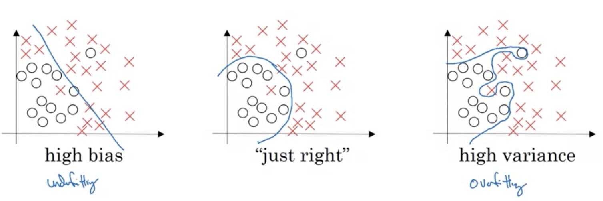
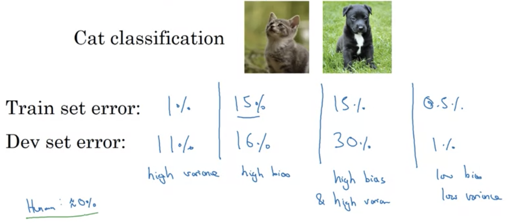
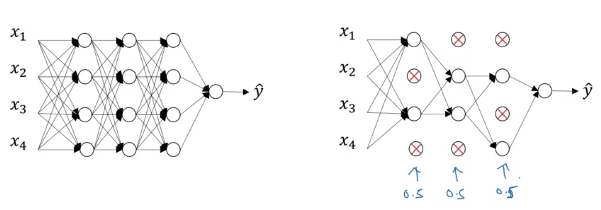
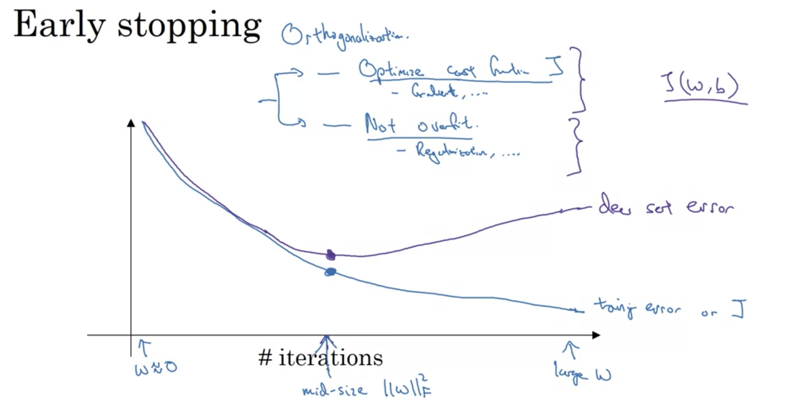
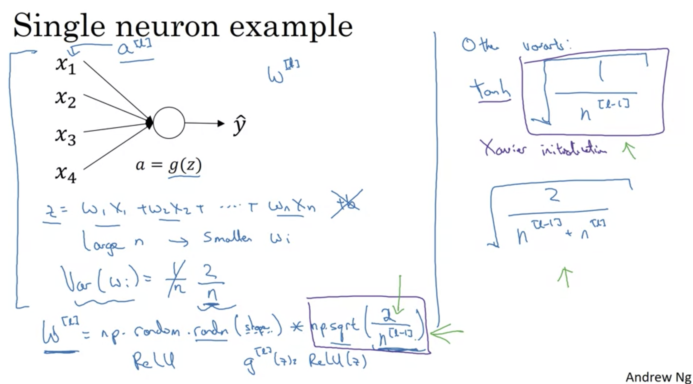
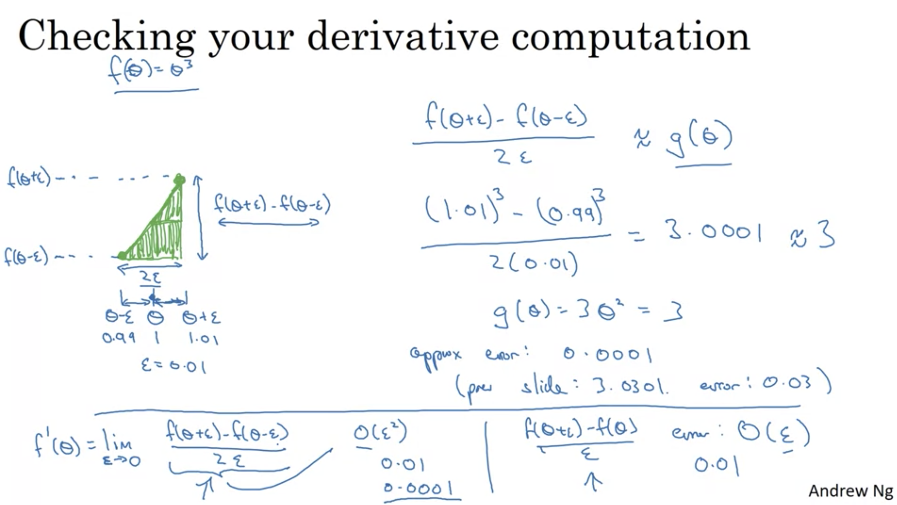
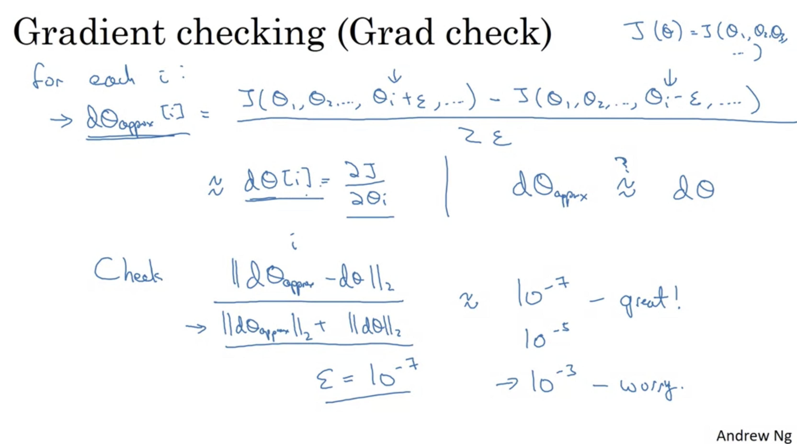
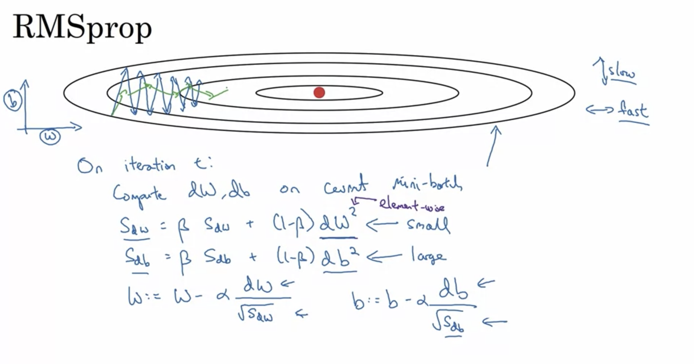
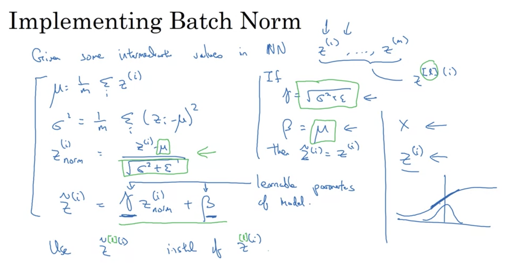
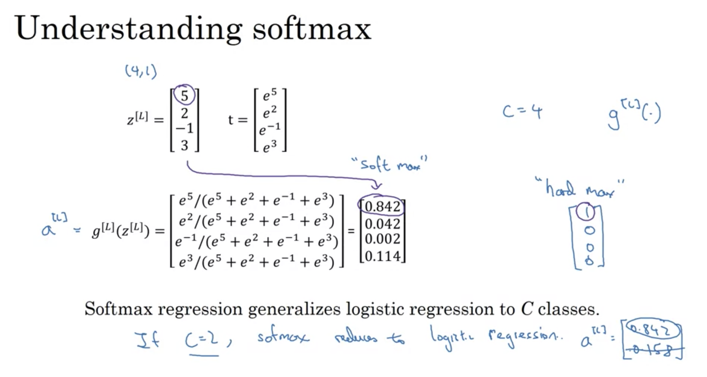

```{r setup, include=FALSE}
library(dplyr)
library(ggplot2)
library(knitr)
knitr::opts_chunk$set(echo = TRUE)
```


## Week 1: [Practical Aspects Of Deep Learning](https://www.coursera.org/learn/deep-neural-network/home/week/1)

## Key Concepts

- Recall that different types of initializations lead to different results
- Recognize the importance of initialization in complex neural networks.
- Recognize the difference between train/dev/test sets
- Diagnose the bias and variance issues in your model
- Learn when and how to use regularization methods such as dropout or L2 regularization.
- Understand experimental issues in deep learning such as Vanishing or Exploding gradients and learn how to deal with them
- Use gradient checking to verify the correctness of your backpropagation implementation

---

## Training, Dev, and Test Set(s)

```{r training-dev-test-barchart, echo=FALSE, fig.height=2, fig.width=11}
library(ggplot2)
 
# create a dataset
`Model Technique(s)` <- c(rep("Traditional" , 3) , rep("Deep Learning" , 3) )
`Type of Dataset` <- rep(c("Train" , "Test" , "Development") , 2)
`Fraction of Data` <- c(70, 15, 15, 99, 1, 1)
dat <- data.frame(`Model Technique(s)`,`Type of Dataset`,`Fraction of Data`)
 
# Stacked + percent
ggplot(dat, aes(fill=`Type of Dataset`, y=`Model Technique(s)`, x=`Fraction of Data`)) + 
    geom_bar(position="fill", stat="identity")
```

To reduce the risk(s) of producing a model that is underfitting (high bias) or overfitting (high variance), partitioning the input dataset has become best practice.  The practice has evolved.

- Train Set: Primary training set, fed to the model
- Development Set: Hold out or Cross-Validation
- Test Set: Used for final metric evaluation; unseen dataset

> Best practice for DNN has evolved as more data has become available, and techniques have matured. As data volumes have increased by orders of magnitude, the training set size can represent a more substantial portion of data.

The catch, the test, and development sets should come from the *same distribution*.

---

## Bia & Variance Refresher



---

## Bias & Variance: A Diagnostic Tool




> Discrepancies between dev and test set can serve as a diagnostic tool for bias & variance assessment of model performance

---

## Bias & Variance: Remediation 'Playbook'

- High Bias (Training Data Performance)
  - Bigger Network
  - Train Longer
  - Consider Alternative NN Infrastructures


- High Variance (Dev set performance)
  - More Data
  - Regularization
  - Consider Alternative NN Infrastructures


Collecting more data, trained on a more extensive network, is often a viable approach.  The "tradeoff" portion of the bias-variance tradeoff less relevant as there are multiple techniques to address either bias or variance without significantly impacting the other.

---

class: center middle inverse

## Regularization


In cases of overfitting (i.e., high variance), regularization reduction techniques are viable ways to reduce variance.  Especially when collecting more data is not possible or cheap.

---

## $L_1$ and $L_2$  Regularization

$L_1$ and $L_2$ Regularization adds a _penalty_ to the cost function based on the parameters. Consider two flavors of regularization, $L_1$ and $L_2$ regularization. Thinking about them as distances in space $L_1$ ($\abs{w}$) represents the Manhattan distance (think arrival by "taxi-cab") vs. $L_2$, which represents the direct line between two points (i.e., as the crow flies). Consider what this looks like for a DNN.


> Attempting to minimize the cost function $J(w^{[1]}, b^{[1]},\dots w^{[L]}, b^{[L]})$.  The cost function, with $L_2$ regularization looks as follows:

$$J(w^{[1]}, b^{[1]},\dots w^{[L]}, b^{[L]}) = \frac{1}{m} \sum_{i=1}^{m} \mathscr{L}(\hat{y}^{[i]}, y^{[i]}) + \frac{\lambda}{2m} \sum_{l=1}^{L} ||w^{[l]}||^{2}_F$$

---

## Understanding the $L_2$ Regularization Term

In this case, the regularization term $||w^{[l]}||^{2}_F$ is called the "Frobenius Norm" of a matrix, not the ${L_2}$ norm. It represents the sum of squares all for elements of a matrix. More specifically:

$$||w^{[l]}||^{2}_F = \sum_{i=1}^{n^{[l-1]}} \sum_{j=1}^{n^{[l]}} (w_{ij}^{[l]})^{2}$$


What about $L_1$? The techniques use of absolute value tends to drive weights to zero, where $L_2$ use of the squared of weights encourages small non-zero numbers. The output of $L_1$ tends to be a more sparsely populated weight matrix, which can be helpful for model compression.  The instructor discounted the benefits of this as a compression mechanism.

---

## Dropout as Regularization

For each layer of the neural network, set probability $p$, such that you randomly remove nodes from the network, removing all the connections into and out of the removed nodes. The removal of these nodes leaves behind a much smaller network on which to train.  First, consider this visually:



```{python, eval=FALSE}
# Inverted Dropout Algorithm; Applied during training; not test
keep_prob = 0.8 # keep 0.8; drop 0.2
d3 = np.random.rand(a3.shape[0], a3.shape[1]) * keep_prob # pick the neurons to keep
a3 = np.multiply(a3, keep_nodes) # drop other neurons to 
a3 = a3 / keep_prob # ensure expected value of a3 remains by rescaling
```


Why does dropout work?

- Intuition: It prevents the over-reliance on any one feature or input.  This is applied to each neuron, cascade throughout the system to reduce reliance on any one element.  In other words, it discourages large weights for any one feature, instead encourages many smaller weights, distributed across inputs.
- Different layer dimensions may encourage different dropouts, (more hidden units? higher dropout may be appropriate)

- Used frequently in computer vision, small-er datasets tend to overfit.
- Make the cost function to be poorly defined (different with each dropout configuration)

---

## Other Regularization Techniques

- Data Augmentation - Simulate new data by augmenting existing data
  - i.e., skew, crop, rotate images (plus many more)



---

## Normalizing Inputs

Normalize Inputs with the following steps:

- Subtract the mean of the feature
  1. $\mu = \frac{1}{m} \sum_\limits{i=1}^{m}x^{(i)}$
  2. $x := x - \mu$
- Normalize the variance
  1. $\sigma^{2} = \frac{1}{m} \sum_\limits{i=1}^{m}x^{(i) **}$ (element wise operation)
      - a.k.a. $\sigma^{2} = \frac{\sum(x_i - \mu)^2}{n - 1}$
  2. $x := \frac{x}{\sigma^{2}}$
  
_Note:_ Apply the same normalizations to your training and test set.

> Why do this? Normalization prevents features of large scale or variance from overpowering other potentially informative features.

---

## Vanishing and Exploding Gradients

Very deep networks, if not carefully initialized, the activations (and gradients) can either grow to very large or very small values, making model training difficult.  _In general, as the number of units increases, we want to decrease the initial value of the weights._



---

## Numerical Approximation of Gradients

The numerical approximation of a gradient is a tool to ensure the proper implementation of backpropagation. Rather than incrementing the value $\theta$ by $\epsilon$ in one direction, we use the terms $\theta + \epsilon$ and $\theta - \epsilon$ to estimate the gradient at $\theta$.  Consider the triangle created or the following definition:

$$f'(\theta) = \lim_{\epsilon \to 0} \frac{f(\theta + \epsilon) - f(\theta - \epsilon)}{2\epsilon}$$



---

## Gradient Check: Algorithm

Setup:
- Take $W^{[1]}, b^{[1]}, \ldots, W^{[L]}, b^{[L]}$; reshape into single vector $\theta$
- Take $dW^{[1]}, db^{[1]}, \ldots,dW^{[L]}, db^{[L]}$; reshape into single vector $d\theta$ 




Notes:

- This process is for debugging only; not for training
- review individual components while debugging
- Does not work with dropout
- Remember regularization techniques
- Run with random initialization

---


## Week 2: [Optimization algorithms](https://www.coursera.org/learn/deep-neural-network/home/week/2)

## Key Concepts

- Remember different optimization methods such as (Stochastic) Gradient Descent, Momentum, RMSProp and Adam
- Use random minibatches to accelerate the convergence and improve the optimization
- Know the benefits of learning rate decay and apply it to your optimization

---

## Algorithm: Mini-batch Gradient Descent

Rather than training on the full dataset for each forward and backward pass, instead, break up the training set $X$ and labels $Y$ into batches of size $m$. Then process each of those smaller batches, in sequence

What about batch size $m$? Consider the extremes...

> If $m$=1; we are performing stochastic gradient descent, and we lose the benefits of vectorization

> If $m = n$; then we are processing the full dataset, and each full pass is likely to take too long

---

## Algorithm: Exponentially Weighted Averages

An *exponentially weighted moving average* is an algorithm that applies to a series of datum, exponentially decreasing weighting of 'older' values but never reaching zero.  Consider the equation for the current value of the weighted average at time t, $v_t$.  $\theta$ represents the observed value at time $t$.

$v_t = \beta v_{t-1} + (1 - \beta )\theta_{t}$

This can be applied as `momentum` to the update rule for gradient descent, given the learning rate $\alpha$ and the weight term $\beta$:

<hr>

- On iteration $t$:
  - Compute $dW$, $db$ on current mini-batch
  - $v_{dW} = \beta v_{dW} + (1 - \beta) dW$
  - $v_{db} = \beta v_{db} + (1 - \beta) db$
  - $W = W - \alpha v_{dW}$
  - $b = b - \alpha v_{db}$

---

## Algorithm: RMSProp

`RMSProp,` i.e., root mean square prop, provides a "dampening" mechanism against large oscillations between gradient batches.



---

## Algorithm: Adam

`Adam` is a combination of `momentum` and `RMSProp` algorithms.

**How does Adam work?**

1. It calculates an exponentially weighted average of past gradients and stores it in variables $v$ (before bias correction) and $v^{corrected}$ (with bias correction). 
2. It calculates an exponentially weighted average of the squares of the past gradients and stores it in variables $s$ (before bias correction) and $s^{corrected}$ (with bias correction). 
3. It updates parameters in a direction based on combining information from "1" and "2".


- Hyperparameters

- *alpha* Also referred to as the learning rate or step size. The proportion that weights are updated (e.g., 0.001). Larger values (e.g., 0.3) results in faster initial learning before the rate is updated. Smaller values (e.g. 1.0E-5) slow learning right down during training

- *beta1* The exponential decay rate for the first moment estimates (e.g., 0.9).

- *beta2* The exponential decay rate for the second-moment estimates (e.g., 0.999). This value should be set close to 1.0 on problems with a sparse gradient (e.g., NLP and computer vision problems).

- *epsilon* Is a tiny number to prevent any division by zero in the implementation (e.g., 10E-8).

---

## Learning Rate Decay

Using different learning rates, $\alpha$, during the training process is a frequent strategy.  For instance, we may choose a large learning rate early on to encourage faster learning, and decrease over time, as a function of the number of epochs.  

Multiple implementations of this adaptive learning rate concept exist.

---

## Week 3: [Hyperparameter tuning, Batch Normalization, and Programming Frameworks](https://www.coursera.org/learn/deep-neural-network/home/week/3)

## Key Concepts

- Master the process of hyperparameter tuning

---

## Hyperparameter Tuning

The complexity and number of parameters can make models challenging to tune.

- Tune Frequently: $\alpha$
- Tune Less Frequently: $\beta$, # of hidden units, #mini-batch size
- Tune even less frequently: everything else...

Considerations while tuning:

- Don't use grid-search; use randomized
- Consider coarse to a granular search strategy
- Pick an appropriate scale, consider log scale to space out search points at different orders of magnitude

When tuning, don't do grid-search, use randomized search, then go coarse to excellent.  Determine a smaller region to explore, then hone in.

---

## Batch Normalization

Can we normalize activations (mean = 0 and $\sigma^2$ = 1) for $a^{[l]}$ given layer, in order to train $w^{[l+1]}$ and $b^{[l+1]}$ more quickly. In this process, we introduce two new learnable hyperparamters $\gamma$ and $\beta$ that can shift and spread the normalized activations.




- Reduces the instability of activation layers, which may make learning difficult on layer layers. It allows layers to learn more independently.

- It has a regularization effect because of noise associated with mini-batch.

- At test time, use an exponentially weighted average of the mean and standard deviation of the activations.

---

## Multi-class classification

A `Softmax` layer is used to identify which of $C$ number of classes is the final output.  The sum of activations for the `Softmax` output adds up to one. For a vector of activations $Z^{[L]}$ where the length of the vector is $C$ do the following.

- Generate a new temporary vector $t$ where we apply the $e^{x}$ to all elements of $Z$ 
- Get sum off all elements in $t$, divide each element of $t$ by the sum
- The resulting vector will be the output of the softmax activation, summing to one.
 
