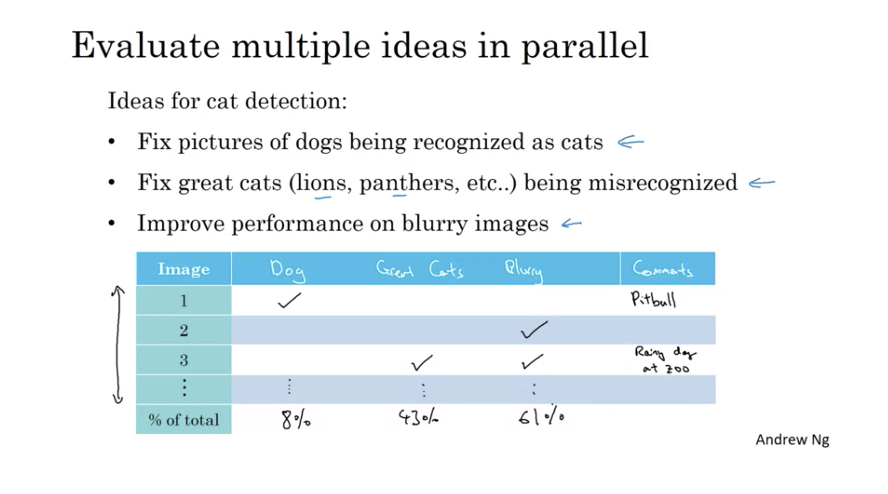
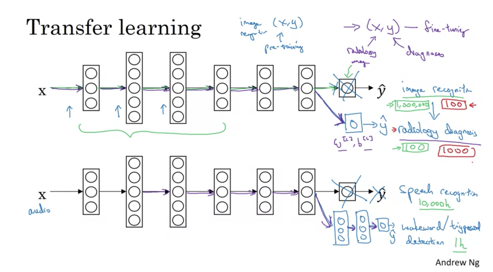
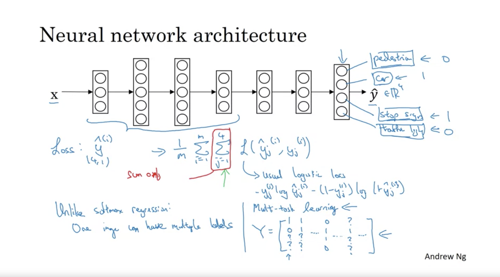

Structuring Machine Learning Projects
================
Brandon Beidel
2020/05/25

## Week 1: [ML Strategy](https://www.coursera.org/learn/machine-learning-projects/home/week/1)

## Key Concepts

  - Understand why Machine Learning strategy is important
  - Apply satisficing and optimizing metrics to set up your goal for ML
    projects
  - Choose a correct train/dev/test split of your dataset
  - Understand how to define human-level performance
  - Use human-level perform to define your key priorities in ML projects
  - Take the correct ML Strategic decision based on observations of
    performances and dataset

-----

## Orthogonalization: Tuning In Machine Learning

Consider the act of driving a car. In a vehicle, each of the controls,
including the steering wheel, brakes, gear selector, and gas pedal, all
impact the vehicle independently of one another. These controls are
considered orthogonal of one another. This makes tuning the car more
straightforward than if multiple ‘knobs’ controlled a single output
(i.e., if speed were a determined by 0.9 \* steering angle + 0.5)

The instructor extends this to tuning an ML model, with a chain of
assumptions for building a model:

1.  Fit a training set well on a cost function

<!-- end list -->

  - To Fix: Bigger Network; Adam

<!-- end list -->

2.  Fit a dev set well on a cost function

<!-- end list -->

  - To Fix: Regularization; Larger Development Set

<!-- end list -->

3.  Fit a test set well on a cost function

<!-- end list -->

  - To Fix: Bigger Dev Set; Ensure correct distribution

<!-- end list -->

4.  Performs well in the real world

<!-- end list -->

  - To Fix: Change Dev Set; Change Cost function

In another framing, this is a separation of concerns concerning inputs.
Each ‘knob’ represents the tuning of an element that does not impact the
others. In the geometric sense, these could be considered knobs that
make changes along unit vectors perpendicular to one another.

-----

## Choosing A Model: Satisficing and Optimizaing Metrics

Consider the scenario where you care about model accuracy and have a
speed and size requirement at score time (faster than 100ms) and size
(smaller than 10mb in memory). By choosing an optimizing metric (a
cost-sensitive error metric), you would select the model that provides
the best score for the optimizing, as long as it satisfies the (i.e.,
meets or exceeds the satisficing metrics.

| classifier | accuracy | size (Mb) | score time (ms) |
| ---------- | -------- | --------- | --------------- |
| A          | 90%      | 8 Mb      | 80 ms           |
| B          | 92%      | 9 Mb      | 90 ms           |
| C          | 95%      | 20 Mb     | 50 ms           |
| D          | 98%      | 6 Mb      | 2000 ms         |

We would choose `B`. It provides the best score for the optimizing
metric (accuracy) while meeting the minimum requirements for all of the
satisficing metrics (fast enough and small enough).

-----

## Bayes Error; Avoidable Bias; and Human performance

Improving a model is a cost-optimization problem. Deciding where to
apply effort should reflect where there is the most opportunity.

| Type        | Error | Notes                                                              |
| ----------- | ----- | ------------------------------------------------------------------ |
| Bayes Error | 3%    | The lowest we can ever achieve (potentially un-knowable).          |
| Human Error | 5%    | What can a human achieve? It can serve as a proxy for Bayes error. |
| Train Error | 10%   | How did we perform on the training set?                            |
| Dev Error   | 12%   | How did we perform on the development set?                         |

Based on the scenario above, we can look to improve our model by
reducing 5% of avoidable bias. (10% Train - 5% Human error, i.e., the
proxy for Bayes error). Compare this to 2% of our variance problem. We
should focus on the bias error first.

Eventually, models may surpass human performance, leaving us without a
proxy for Bayes error. This tends to occur with structural data, not
based on human perception, where there is a lot of data. (i.e. online
marketing, product recommendation, logistics, loan approvals)Improving a
model is a cost-optimization problem. Deciding where to apply effort for
the greatest benefit requires a few additional concepts.

-----

## Week 2: [ML Strategy](https://www.coursera.org/learn/machine-learning-projects/home/week/2)

## Key Concepts

  - Understand what multi-task learning and transfer learning are
  - Recognize bias, variance and data-mismatch by looking at the
    performances of your algorithm on train/dev/test sets

-----

## Error Analysis

Reviewing a random selection of errors in the dev or test set can help
identify sub-sets of data to focus on. Again, this should be a
cost-sensitive prioritization. It can help evaluate multiple ideas in
parallel.

-----

## Transfer Learning

Transfer learning (TL) is a research problem in machine learning (ML)
that focuses on storing knowledge gained while solving one problem and
applying it to a different but related problem. For example, the
knowledge gained while learning to recognize cars could apply when
trying to recognize trucks.

-----

## Multi-Task Learning

Multi-task learning (MTL) is a subfield of machine learning in which
multiple learning tasks are solved at the same time while exploiting
commonalities and differences across tasks. This can result in improved
learning efficiency and prediction accuracy for the task-specific models
when compared to training the models separately.

